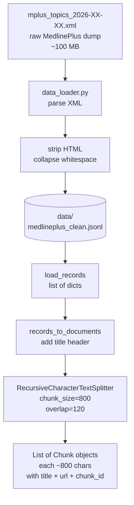
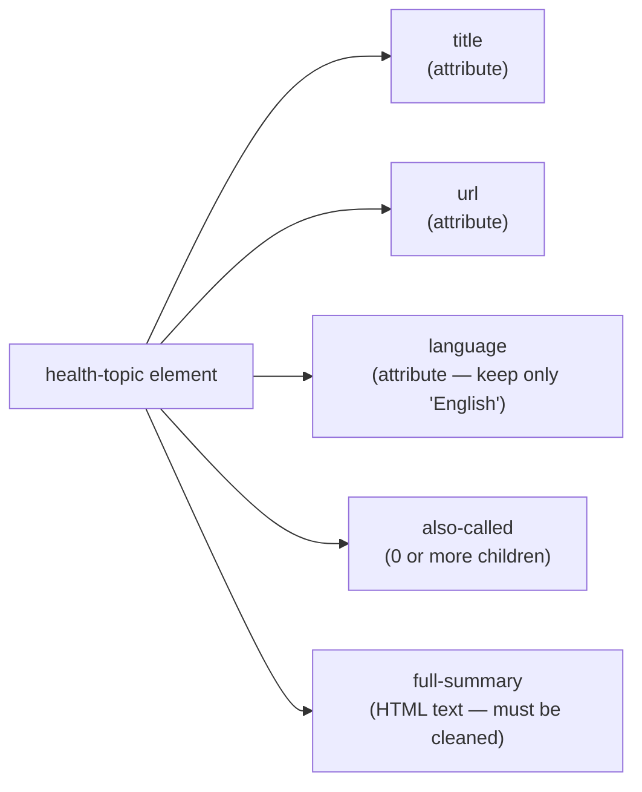
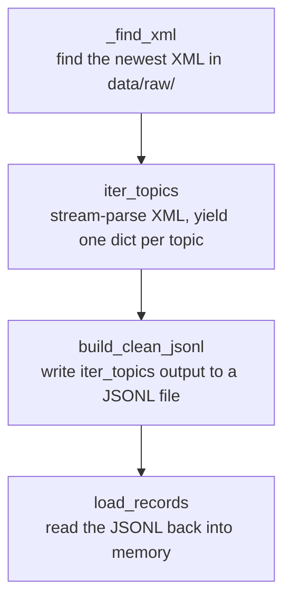
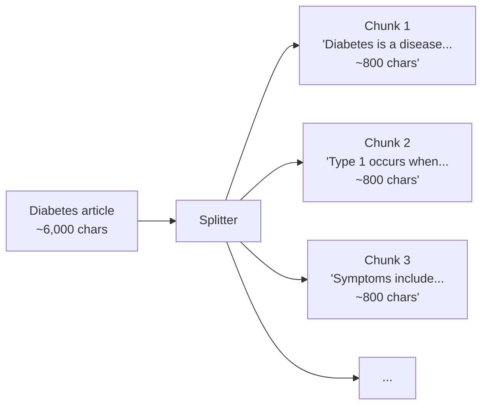
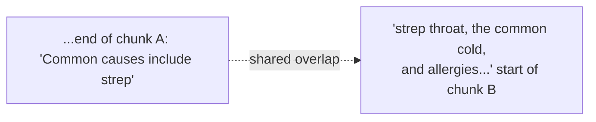
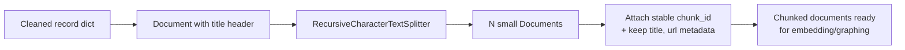
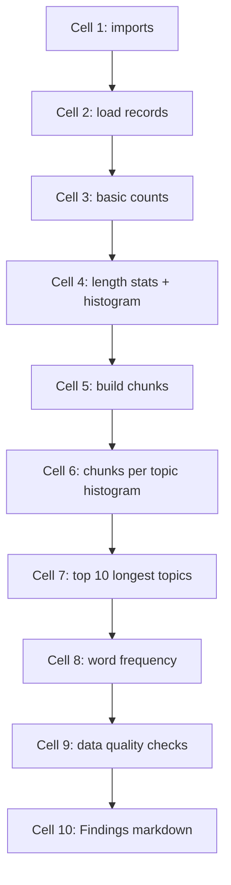

# Phase 1 — Data Ingestion

**Duration:** Weeks 2–3 (around 8–12 hours of focused work per person)
**Goal:** Turn the raw MedlinePlus XML file into a clean, well-structured corpus. By the end of this phase, every team member understands the data — its shape, size, and quirks — and the project has a JSONL file plus chunked documents ready to be embedded and graphed in Phases 2 and 3.

Retrieval quality in Phase 3 will trace back to choices made here. Time spent on data quality is not wasted.

---

## Table of Contents

1. [Overview](#1-overview)
2. [Definition of "done"](#2-definition-of-done)
3. [Time budget](#3-time-budget)
4. [Working principles](#4-working-principles)
5. [The data pipeline at a glance](#5-the-data-pipeline-at-a-glance)
6. [Why MedlinePlus?](#6-why-medlineplus)
7. [Step 1 — Download the XML](#7-step-1--download-the-xml)
8. [Step 2 — Understand the XML structure](#8-step-2--understand-the-xml-structure)
9. [Step 3 — Read `data_loader.py`](#9-step-3--read-data_loaderpy)
10. [Step 4 — Run the loader](#10-step-4--run-the-loader)
11. [Step 5 — Inspect the cleaned JSONL](#11-step-5--inspect-the-cleaned-jsonl)
12. [Step 6 — Concept: what is a "chunk"?](#12-step-6--concept-what-is-a-chunk)
13. [Step 7 — Read `chunker.py`](#13-step-7--read-chunkerpy)
14. [Step 8 — Run the chunker (with skips)](#14-step-8--run-the-chunker-with-skips)
15. [Step 9 — Experiment with chunk sizes](#15-step-9--experiment-with-chunk-sizes)
16. [Step 10 — Build the EDA notebook](#16-step-10--build-the-eda-notebook)
17. [Common errors and how to fix them](#17-common-errors-and-how-to-fix-them)
18. [Definition of Done — checklist](#18-definition-of-done--checklist)
19. [Demo](#19-demo)
20. [What's next](#20-whats-next)

---

## 1. Overview

Phase 1 covers the data pipeline:

- Loading and cleaning the raw MedlinePlus XML.
- Splitting the cleaned text into chunks suitable for embedding and graph extraction.
- Producing an exploratory data analysis (EDA) notebook that describes the corpus.

Real-world data is messy: some articles will have formatting quirks, others will be empty stubs, others extremely long. Part of this phase is observing those properties directly and recording them.

Most of the work consists of reading the skeleton code, running it, inspecting outputs, and writing an EDA notebook. Little new code is written.

### 1.1 Skeleton files read (not modified)

These files already exist in the repo and are read carefully during this phase:

| File | Purpose |
|---|---|
| `backend/app/ingestion/data_loader.py` | Parses MedlinePlus XML, strips HTML, writes JSONL |
| `backend/app/ingestion/chunker.py` | Wraps records as `Document` objects and splits them into chunks |
| `backend/scripts/ingest.py` | One-shot pipeline runner (with `--skip-vectors`, `--skip-graph` for this phase) |
| `backend/app/config.py` | Where `CHUNK_SIZE`, `CHUNK_OVERLAP`, and paths are defined |

### 1.2 Artifacts produced in this phase

| Path | Created by | Purpose |
|---|---|---|
| `data/raw/mplus_topics_*.xml` | Downloaded by hand | Raw source corpus |
| `data/medlineplus_clean.jsonl` | `data_loader.py` | One cleaned health topic per line |
| `notebooks/01_eda.ipynb` | Team writes | EDA notebook — the main written deliverable |
| `notebooks/00_chunk_experiments.ipynb` *(optional)* | Team writes | Scratch notebook for Step 9 chunk-size trials |

The chunked `Document` objects exist only in memory at this stage; they are persisted to Chroma and the graph in Phases 2 and 3.

---

## 2. Definition of "done"

By the end of Phase 1, each team member should be able to:

- Open `data/raw/mplus_topics_*.xml` and identify its structure.
- Open `data/medlineplus_clean.jsonl` and explain what each line represents.
- Run the data loader from a clean terminal and observe the JSONL being built.
- Run the chunker and inspect a sample of chunks.
- Explain what `chunk_size=800, chunk_overlap=120` means.
- Produce an EDA notebook with at least five plots or numerical summaries describing the corpus.
- Answer: *"How many topics are in the corpus, and what is the median text length in characters?"*

Embeddings, graphs, retrieval, and LLM logic are not built in this phase.

---

## 3. Time budget

Per person, spread across two weeks:

| Task | Time |
|---|---|
| Download XML, understand its shape | 30 min |
| Read `data_loader.py`, run it, inspect output | 60 min |
| Read `chunker.py`, run it, inspect output | 60 min |
| Chunk-size experiments | 60 min |
| EDA notebook | 3–4 hours |
| Team review and small fixes | 1–2 hours |
| Buffer | 1–2 hours |
| **Total** | **~8 hours** |

---

## 4. Working principles

**1. Open files with a text editor, not just code.** Phase 1 is about *seeing* data. Use VS Code or another editor that handles large XML files.

**2. Print samples often.** When calling a function, print a sample of its output. Shapes can mislead; visible samples don't.

**3. Avoid over-engineering the loader.** Skip fancy normalisation, deduplication, or language detection at this stage. Get an end-to-end version working first; improve later if Phase 5 metrics demand it.

---

## 5. The data pipeline at a glance



Two outputs matter most:

- **`data/medlineplus_clean.jsonl`** — one JSON object per line, one line per MedlinePlus health topic. This is the human-readable artefact for data QA.
- **A Python list of `Document` objects** (in memory at this phase) — the chunked form consumed by Phases 2–3.

---

## 6. Why MedlinePlus?

MedlinePlus is published by the US National Library of Medicine. It was chosen because:

- ✅ **Public domain** — no licensing concerns.
- ✅ **Structured** — bulk XML with consistent fields per topic.
- ✅ **Authoritative** — written and reviewed by medical librarians.
- ✅ **Right-sized** — approximately 1,000 health topics; large enough to be interesting, small enough to ingest on a laptop.
- ✅ **Plain language** — written for patients, not clinicians, which matches the chatbot's intended audience.

Per-topic example in the browser: <https://medlineplus.gov/sorethroat.html>. The bulk XML dump aggregates all topics.

---

## 7. Step 1 — Download the XML

1. Open <https://medlineplus.gov/xml.html>.
2. Locate the **"Health topics"** file — *Topics with Full Summary in English*. It is a `.zip`.
3. Download and unzip. The archive contains a file named like `mplus_topics_2026-XX-XX.xml`.
4. Move the XML into the project at `data/raw/`. Final path:

```
data/raw/mplus_topics_2026-XX-XX.xml
```

> 🛑 **Do not commit this file to Git.** `data/raw/` is already gitignored. Confirm with `git status` — the XML should not appear as a new file.

Expected file size: approximately **80–150 MB**.

---

## 8. Step 2 — Understand the XML structure

Open the XML in an editor capable of handling large files (VS Code is fine).

Past the header lines, the file consists of many `<health-topic>` elements, each shaped roughly like this (abridged):

```xml
<health-topic
    title="Sore Throat"
    url="https://medlineplus.gov/sorethroat.html"
    language="English">
  <also-called>Pharyngitis</also-called>
  <full-summary>
    &lt;p&gt;Your throat is a tube that carries food to your esophagus...&lt;/p&gt;
    &lt;p&gt;Causes of sore throat include...&lt;/p&gt;
  </full-summary>
  <site title="..." url="..."/>
  ...
</health-topic>
```

Points to notice:

1. **`title`** and **`url`** are attributes of the element, not children.
2. **`<full-summary>`** contains HTML (the `&lt;p&gt;` is an escaped `<p>` tag). HTML must be stripped.
3. Entries exist for both English and Spanish. Only English is needed (`language` attribute).
4. Some topics have multiple **`<also-called>`** aliases. These are kept.

Fields extracted from each `<health-topic>`:



All other elements — site links, group categories, mesh-headings — are ignored for the MVP.

---

## 9. Step 3 — Read `data_loader.py`

Open **`backend/app/ingestion/data_loader.py`** and read the entire file (~80 lines).

Four functions to understand:



Notes:

- **Stream parsing.** `lxml.etree.iterparse` is used instead of loading the whole file. The XML is large; `iterparse` yields one element at a time and allows memory to be freed.
- **HTML stripping.** The `_strip_html` helper passes `<full-summary>` content through BeautifulSoup to strip tags and collapse whitespace. No `<p>` or `&nbsp;` should leak into chunks.
- **Skip non-English.** `language != "English"` triggers an early `continue`.
- **JSONL output.** One JSON object per line. This format streams well and supports `head -5` inspection.

Add a `# Read 2026-05-XX` comment to the top of the file when finished.

---

## 10. Step 4 — Run the loader

From the **project root**, with the **backend venv active**:

```bash
python -m backend.app.ingestion.data_loader
```

Expected output:

```
Parsing mplus_topics_2026-05-12.xml ...
1,176 topics [00:08, 138.05 topics/s]
Wrote 1176 topics to ......\telemed-AI\data\medlineplus_clean.jsonl
```

The topic count varies — anything in the range of 1,000–1,300 is normal.

> ✅ **Checkpoint — artifact created.** A new file `data/medlineplus_clean.jsonl` should exist (one JSON object per line, one line per English health topic). If it does not, the loader failed silently; re-run with added print statements.

---

## 11. Step 5 — Inspect the cleaned JSONL

Open `data/medlineplus_clean.jsonl` in an editor.

Each line is one JSON object:

```json
{"title": "Sore Throat", "url": "https://medlineplus.gov/sorethroat.html", "also_called": ["Pharyngitis"], "text": "Your throat is a tube that carries food to your esophagus..."}
```

Spend ~10 minutes browsing. Check for:

- Sensible titles, no blanks.
- No residual HTML tags (`<p>`, `<br>`, `&amp;`, etc.) in the `text` field.
- Range of text lengths — shortest vs longest.
- Apparent duplicates (e.g. "Heart Attack" and "Myocardial Infarction").

Note any issues in the team channel.

Inspection from Python:

```python
import json
recs = [json.loads(l) for l in open("data/medlineplus_clean.jsonl", encoding="utf-8")]
print(len(recs))
print(recs[0].keys())
print(recs[0]["title"])
print(recs[0]["text"][:300])
```

---

## 12. Step 6 — Concept: what is a "chunk"?

**Problem:** A MedlinePlus article on Diabetes is ~6,000 characters. Embedding the whole article into a single vector produces an "average" representation that mixes symptoms, treatment, and prevention together. Searching for "what causes type 2 diabetes" competes with the rest of the article's content.

**Solution:** Split each article into smaller pieces (chunks). Embed each chunk separately. Retrieval then returns the specific paragraph relevant to the query, not the whole article.



**Chunk size trade-offs:**

| chunk_size | Effect |
|---|---|
| Very small (e.g. 100 chars) | Many tiny chunks. Each has too little context. The LLM receives fragmented sentences. |
| Very large (e.g. 4000 chars) | Few large chunks. Each embedding averages too many ideas. Retrieval becomes imprecise. |
| ✅ Reasonable (600–1000 chars) | A coherent paragraph or two. Self-contained. Good embedding behaviour. |

**Overlap.** Consecutive chunks share a small region (default 120 chars) so sentences are not cut at boundaries:



These numbers are revisited in Step 9.

---

## 13. Step 7 — Read `chunker.py`

Open **`backend/app/ingestion/chunker.py`** (~50 lines).

Three points to note:

1. **`records_to_documents`** wraps each MedlinePlus record into a LangChain `Document`. A small header (`# Sore Throat\nAlso known as: Pharyngitis\n\n...`) is prepended so the title is included in embeddings.

2. **`chunk_documents`** uses LangChain's `RecursiveCharacterTextSplitter`. "Recursive" means: try `\n\n` (paragraph) as a separator first; if a paragraph is still too long, fall back to `\n`, then `. `, then space, then character. This keeps chunks grammatically clean.

3. **`chunk_id`** is a stable hash (sha1 of title + index + content prefix). Every chunk has a deterministic ID so the graph (Phase 2) can record *"this chunk mentions Strep Throat"* and later look the chunk up by ID. This is the bridge between the graph and the vector store.



Add the `# Read 2026-05-XX` comment when finished.

---

## 14. Step 8 — Run the chunker (with skips)

The chunker runs as part of the full ingestion pipeline in `backend/scripts/ingest.py`. Embedding and graph-building belong to Phases 2 and 3 and should be skipped here.

To run only steps 1–2 (data + chunking, no embedding, no graph):

```bash
python -m backend.scripts.ingest --skip-vectors --skip-graph
```

Expected output:

```
Step 1/4: loading clean MedlinePlus records ...
  loaded 1176 topics
Step 2/4: chunking ...
  produced 5832 chunks from 1176 documents
Step 3/4: SKIPPED (--skip-vectors)
Step 4/4: SKIPPED (--skip-graph)

Done. Next:
  uvicorn backend.app.main:app --reload --port 8000
```

> Numbers will vary; the chunk count should be approximately 4–6× the topic count.

This is the **Phase 1 deliverable command.** It confirms that `data/medlineplus_clean.jsonl` is parsed and chunked successfully. No new artifact is written to disk here — the chunks live in memory and will be persisted to Chroma + the graph in later phases.

---

## 15. Step 9 — Experiment with chunk sizes

This step optionally produces a scratch notebook at `notebooks/00_chunk_experiments.ipynb` that records the comparison. Either a notebook or a Python REPL inside the backend venv is acceptable.

```python
from backend.app.ingestion.data_loader import load_records
from backend.app.ingestion.chunker import records_to_documents, chunk_documents
from langchain_text_splitters import RecursiveCharacterTextSplitter

records = load_records()
docs = records_to_documents(records)

def chunk_with(size: int, overlap: int):
    splitter = RecursiveCharacterTextSplitter(
        chunk_size=size, chunk_overlap=overlap,
        separators=["\n\n", "\n", ". ", " ", ""],
    )
    return splitter.split_documents(docs)

for sz, ov in [(400, 60), (800, 120), (1200, 200), (2000, 300)]:
    chunks = chunk_with(sz, ov)
    print(f"size={sz:>5}  overlap={ov:>4}  →  {len(chunks):>6} chunks   "
          f"avg_len={sum(len(c.page_content) for c in chunks)/len(chunks):.0f}")
```

Example output:

```
size=  400  overlap=  60  →  10821 chunks   avg_len=395
size=  800  overlap= 120  →   5832 chunks   avg_len=782
size= 1200  overlap= 200  →   4001 chunks   avg_len=1170
size= 2000  overlap= 300  →   2401 chunks   avg_len=1947
```

Inspect actual chunks, not just counts:

```python
chunks_800 = chunk_with(800, 120)
chunks_400 = chunk_with(400, 60)

print("---- 800 ----")
print(chunks_800[10].page_content)
print("\n---- 400 ----")
print(chunks_400[20].page_content)
```

The trade-off: larger chunks carry more context per piece but produce fewer pieces and lose retrieval precision. Discuss the team's chosen default. `800/120` is the current setting and is reasonable for the MVP; revisit during Phase 5 evaluation if metrics indicate otherwise.

---

## 16. Step 10 — Build the EDA notebook

The EDA notebook is the primary written deliverable for Phase 1 and the main new file produced by the team in this phase.

**File to create:** `notebooks/01_eda.ipynb` (create the `notebooks/` folder at the project root if it does not exist yet).

The notebook should answer at least the following questions about the corpus.

### 16.1 Basic counts
- Total topic count.
- Unique-title count (should equal total).
- Number of topics with at least one `also_called` alias.

### 16.2 Length distribution
- Character count per topic's `text` field.
- Min, max, mean, median, 95th percentile.
- Histogram of text lengths (30 bins).
- Count of topics shorter than 200 characters (likely stubs).

### 16.3 Chunk distribution
- Run `chunk_documents` with default settings.
- Total chunk count.
- Histogram of chunks-per-topic. (Most topics produce 3–8; a few produce 30+.)
- Top 10 topics by chunk count. Likely correspond to the longest articles.

### 16.4 Word frequency (rough)
- Concatenate all `text` values. Lowercase. Split on whitespace.
- `collections.Counter` of the top 30 tokens.
- Mostly stopwords — this is a sanity check, not a feature.

### 16.5 Data quality checks
- Topics with empty `text` (should be zero).
- Topics whose `text` contains `<p>`, `<br>`, or `&amp;` (should be zero — indicates a stripping bug).
- Duplicate titles (should be zero).

### 16.6 Findings cell

The notebook should end with a **Findings** markdown cell summarising 3–5 observations, e.g.:

> - The corpus has **1,176 topics** and chunks into **5,832 pieces** with default settings.
> - Median article length is **~3,200 characters**; the longest is ~28k.
> - Three articles produce 30+ chunks each — they are long overview pieces ("Cancer", "Heart Diseases", "Diabetes").
> - No empty articles and no HTML leakage detected.
> - 4 articles are unusually short (< 200 chars); they appear to be redirect stubs. Kept for now.

Notebook flow:



---

## 17. Common errors and how to fix them

### `FileNotFoundError: No MedlinePlus XML found in data/raw/`
The XML is missing from `data/raw/`, or its filename does not start with `mplus_topics_`. Move or rename the file.

### Loader runs without printing
Likely the wrong MedlinePlus file. Confirm size is in the 80–150 MB range. A file of several hundred MB may be the encyclopaedia dump.

### `lxml.etree.XMLSyntaxError`
The XML was truncated or corrupted during download. Re-download.

### `UnicodeDecodeError` when reading the JSONL
Open the file with UTF-8 encoding:
```python
open("data/medlineplus_clean.jsonl", encoding="utf-8")
```

### `ModuleNotFoundError: No module named 'backend'`
The command was not run from the project **root**. `cd` to the root and re-run.

### `pip install` of `lxml` fails on Linux
```bash
sudo apt install libxml2-dev libxslt1-dev
pip install --upgrade lxml
```

### Jupyter is not installed in the venv
```bash
pip install jupyter
jupyter notebook
```
Alternatively, open the `.ipynb` file directly in VS Code, which has built-in notebook support.

### Some `text` fields read fine but the chunker splits them oddly
Likely the underlying HTML used `<br>` rather than `<p>`, collapsing paragraphs into one long line. Acceptable for the MVP; record the observation in the findings.

### Notebook outputs do not show in GitHub
Save with outputs included (run all cells, then `File → Save and Checkpoint`). GitHub renders saved outputs.

---

## 18. Definition of Done — checklist

Phase 1 is complete when, as a team, all of the following are true:

- [ ] `data/raw/mplus_topics_*.xml` exists.
- [ ] Every team member has run `python -m backend.app.ingestion.data_loader` successfully.
- [ ] `data/medlineplus_clean.jsonl` exists with > 500 lines (produced by the loader).
- [ ] Every team member has opened the JSONL and read at least 5 entries.
- [ ] Every team member has read `data_loader.py` and `chunker.py` and added the *Read* comment.
- [ ] `python -m backend.scripts.ingest --skip-vectors --skip-graph` runs end-to-end without errors.
- [ ] The chunker produces at least 3× as many chunks as topics.
- [ ] The chunk-size experiment (Step 9) has been run and results discussed.
- [ ] `notebooks/01_eda.ipynb` has been created and contains all six sections from Step 10 plus a Findings markdown cell.
- [ ] `notebooks/01_eda.ipynb` is committed with cell outputs visible.
- [ ] At least one PR has been opened and merged into `main`.
- [ ] Cell 9 of the EDA notebook confirms no HTML tags leak into chunks.

---

## 19. Demo

End-of-Week-3 walkthrough (10–15 minutes):

1. **Show the raw XML** in an editor — open one `<health-topic>` element and identify the fields.
2. **Run the loader from scratch** — `python -m backend.app.ingestion.data_loader`. Show the progress to completion.
3. **Open the JSONL** — read one entry aloud.
4. **Run the chunker** — `python -m backend.scripts.ingest --skip-vectors --skip-graph`. Show the chunk count.
5. **Walk through the EDA notebook** — share screen, run a few cells live, show the histograms.
6. **Discuss findings** — surprising observations, data-quality concerns, chunk-size decisions.
7. **Q&A.**

Each member should present at least one section.

---

## 20. What's next

**Phase 2 (Week 4)** builds the **knowledge graph**. The chunks produced in this phase will be fed, one at a time, into the local LLM with a prompt that extracts:

- entities (`Condition`, `Symptom`, `BodyPart`, `Treatment`, `RiskFactor`, `Medication`)
- relations (`HAS_SYMPTOM`, `AFFECTS`, `TREATED_BY`, `INCREASES_RISK_OF`, `LOCATED_IN`)

These triples are assembled into a NetworkX graph and persisted to disk. It is the slowest ingestion step but the one that gives the project its GraphRAG character.

Before Phase 2 begins, skim `entity_extractor.py` and `graph_builder.py` to avoid a cold start.
