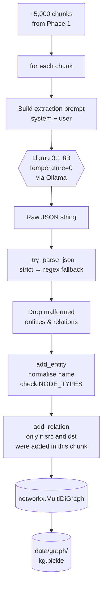
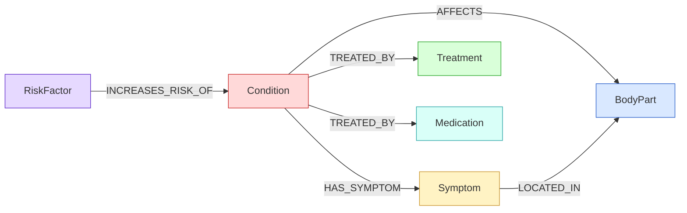
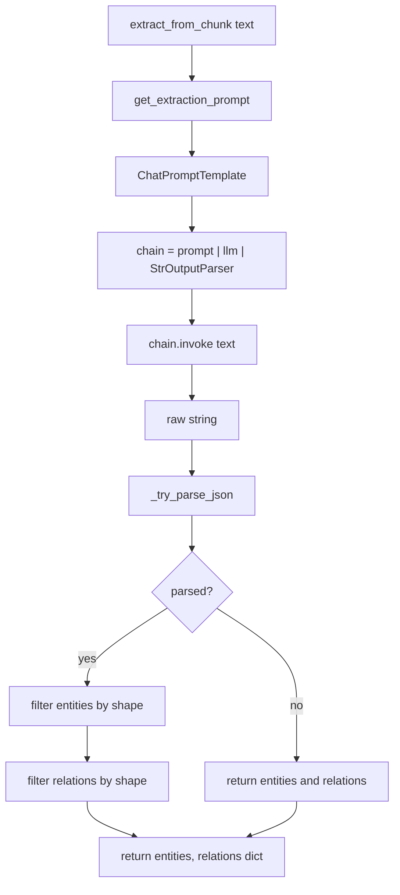
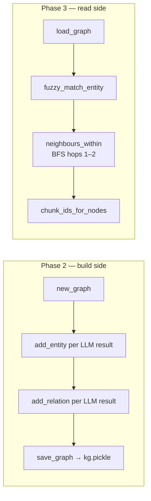
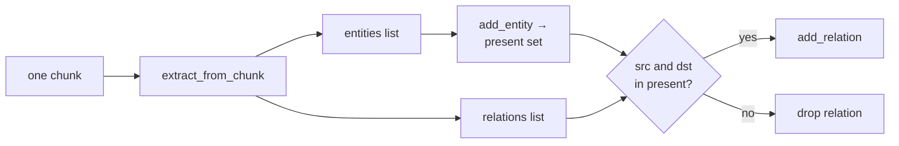
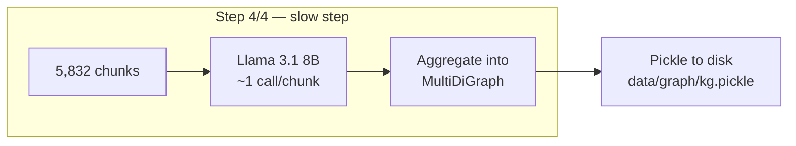

# Phase 2 — Knowledge Graph Construction

**Duration:** Week 4 (around 6–10 hours of focused work per person, plus one long unattended run)
**Goal:** Turn the chunked MedlinePlus corpus into a NetworkX knowledge graph by running LLM-powered entity and relation extraction over every chunk. By the end of this phase the project has a single pickled graph file on disk containing the *Conditions*, *Symptoms*, *BodyParts*, *Treatments*, *RiskFactors*, and *Medications* that the retrieval pipeline in Phase 3 will walk.

The graph is what makes this project GraphRAG rather than plain RAG. Time spent here on prompt quality directly determines whether Phase 3's symptom→condition reasoning works.

---

## Table of Contents

1. [Overview](#1-overview)
2. [Definition of "done"](#2-definition-of-done)
3. [Time budget](#3-time-budget)
4. [Working principles](#4-working-principles)
5. [The graph pipeline at a glance](#5-the-graph-pipeline-at-a-glance)
6. [The graph schema](#6-the-graph-schema)
7. [Step 1 — Read `entity_extractor.py`](#7-step-1--read-entity_extractorpy)
8. [Step 2 — Concept: prompt engineering for structured output](#8-step-2--concept-prompt-engineering-for-structured-output)
9. [Step 3 — Test extraction on 20 chunks](#9-step-3--test-extraction-on-20-chunks)
10. [Step 4 — Tune the extraction prompt](#10-step-4--tune-the-extraction-prompt)
11. [Step 5 — Read `graph_store.py`](#11-step-5--read-graph_storepy)
12. [Step 6 — Read `graph_builder.py`](#12-step-6--read-graph_builderpy)
13. [Step 7 — Run a partial build (`--limit 50`)](#13-step-7--run-a-partial-build---limit-50)
14. [Step 8 — Inspect the partial graph in a REPL](#14-step-8--inspect-the-partial-graph-in-a-repl)
15. [Step 9 — Run the full ingestion](#15-step-9--run-the-full-ingestion)
16. [Step 10 — Visualise the graph with pyvis (optional)](#16-step-10--visualise-the-graph-with-pyvis-optional)
17. [Common errors and how to fix them](#17-common-errors-and-how-to-fix-them)
18. [Definition of Done — checklist](#18-definition-of-done--checklist)
19. [Demo](#19-demo)
20. [What's next](#20-whats-next)

---

## 1. Overview

Phase 2 covers the **knowledge-graph construction** step of the ingestion pipeline:

- Reading each ~800-character chunk produced in Phase 1.
- Asking the local LLM (Llama 3.1 8B via Ollama) for a JSON object listing the medical entities and the relationships that appear in that chunk.
- Validating and normalising those entities and relations.
- Adding them as nodes and edges to an in-memory `networkx.MultiDiGraph`.
- Pickling the graph to `data/graph/kg.pickle`.

Almost no new code is written. Most of the work is **reading** the three skeleton files, **running** them, **observing** the LLM's output, and **iterating** on the extraction prompt until output quality is good enough.

> ⚠️ This is the slowest step in the project — one LLM call per chunk, ~5,000 chunks, single-threaded. A full run takes 30–90 minutes on a laptop CPU. Plan for one unattended evening run.

### 1.1 Skeleton files read (not modified)

These files already exist in the repo and are read carefully during this phase:

| File | Purpose |
|---|---|
| `backend/app/services/entity_extractor.py` | Sends one chunk to the LLM, parses the JSON, returns `{entities, relations}` |
| `backend/app/services/prompts.py` | Contains `EXTRACTION_SYSTEM`, `EXTRACTION_USER`, and `QUERY_ENTITY_*` prompts |
| `backend/app/services/graph_store.py` | NetworkX wrapper: `add_entity`, `add_relation`, `save_graph`, `load_graph`, fuzzy matching, BFS |
| `backend/app/ingestion/graph_builder.py` | Walks every chunk, calls the extractor, populates the graph, pickles it |
| `backend/app/config.py` | `NODE_TYPES`, `EDGE_TYPES`, `GRAPH_PICKLE` path |
| `backend/scripts/ingest.py` | Pipeline runner with `--limit` and `--skip-vectors` |

### 1.2 Artifacts produced in this phase

| Path | Created by | Purpose |
|---|---|---|
| `data/graph/kg.pickle` | `graph_builder.build_graph_from_chunks` | The persisted knowledge graph (loaded at backend startup in Phase 4) |
| `data/chroma/` | `vector_store.build_vector_store` *(only if `--skip-vectors` is not passed)* | Chroma vector store directory — see note below |
| `notebooks/02_graph_inspection.ipynb` *(optional)* | Team writes | Scratch notebook for Step 8 inspection and Step 10 pyvis visualisation |

> 💡 **Which command produces which artifact?** `python -m backend.scripts.ingest --skip-vectors --limit 50` produces only the partial graph. `python -m backend.scripts.ingest` (no flags) produces **both** the graph and the Chroma store in one run — this is the recommended one-and-done full ingestion at the end of Phase 2, since Phase 3 needs the Chroma store anyway.

---

## 2. Definition of "done"

By the end of Phase 2, each team member should be able to:

- Open `entity_extractor.py` and explain what `_try_parse_json` falls back to and why.
- Recite the six node types and five edge types from memory (they map to `NODE_TYPES` / `EDGE_TYPES` in `config.py`).
- Run extraction on a single chunk in a REPL and inspect the raw JSON.
- Explain why `temperature=0.0` matters for this prompt and why `temperature=0.7` would break the pipeline.
- Run `python -m backend.scripts.ingest --skip-vectors --limit 50` and observe the tqdm progress bar.
- Open `data/graph/kg.pickle` in a REPL via `load_graph()` and answer: *"How many nodes? How many edges? What are the neighbours of `sore throat`?"*
- Identify at least one entity-extraction failure mode (e.g. plural names, hallucinated relations, wrong type strings) and describe how the existing validation code catches it.

Retrieval, prompt-merging, and the RAG chain are **not** built in this phase.

---

## 3. Time budget

Per person, across one week:

| Task | Time |
|---|---|
| Read `entity_extractor.py` and `prompts.py` | 45 min |
| Test extraction on 20 chunks, observe failures | 60 min |
| Prompt tuning (Step 4) | 60–90 min |
| Read `graph_store.py` and `graph_builder.py` | 45 min |
| Partial run (`--limit 50`) and REPL inspection | 45 min |
| Full ingestion run | 30–90 min unattended (~10 min interactive) |
| Optional pyvis visualisation | 60 min |
| Team review and small fixes | 1–2 hours |
| **Total** | **~6–8 hours interactive + 1 unattended run** |

---

## 4. Working principles

**1. Look at the LLM's actual output, every time.** The extractor returns a Python dict, but the LLM returns *text*. Print the raw string before parsing. Most "the graph is bad" problems are visible in the raw text.

**2. Validate at the boundary, then trust.** `entity_extractor.py` and `graph_store.py` both drop malformed items rather than crash. Once data is *inside* the graph it conforms to the schema. Do not add defensive checks downstream — fix the extractor instead.

**3. Iterate on prompts with `--limit 50` runs, not full runs.** A 90-minute feedback loop kills iteration. Use 50 chunks (~1 minute) for prompt work and reserve the full run for when the prompt is settled.

---

## 5. The graph pipeline at a glance



Two outputs matter most:

- **`data/graph/kg.pickle`** — a `networkx.MultiDiGraph` with typed nodes, typed edges, and `source_chunk_ids` on every node. This is loaded at backend startup in Phase 4 and walked at query time in Phase 3.
- **A printed summary at the end of the run**: `Graph built: N nodes, M edges. Failed extractions: F/T.` These three numbers are the smoke test for whether the build is healthy.

---

## 6. The graph schema

The schema is intentionally small. A tight schema gives the LLM less room to invent. Reuse from `GUIDE.md` §10:



The exact strings live in `backend/app/config.py`:

```python
NODE_TYPES = ("Condition", "Symptom", "BodyPart", "Treatment", "RiskFactor", "Medication")
EDGE_TYPES = ("HAS_SYMPTOM", "AFFECTS", "TREATED_BY", "INCREASES_RISK_OF", "LOCATED_IN")
```

Every node carries:
- a normalised **`name`** (lowercase, whitespace-collapsed — used as the NetworkX node key)
- a **`display_name`** (the LLM's original casing)
- a **`type`** (one of `NODE_TYPES`)
- a **`source_chunk_ids`** list — the chunks that mention this entity. This is the bridge that lets graph traversal retrieve text from Chroma in Phase 3.

Every edge carries a **`type`** (one of `EDGE_TYPES`) and a **`source_chunk_id`** (the single chunk the relation was extracted from).

> 💡 **Why `MultiDiGraph`?** The graph is **directed** because relations are asymmetric (`Smoking INCREASES_RISK_OF Lung Cancer` is not the same as the reverse). It is **multi** because the same `(Condition, HAS_SYMPTOM, Symptom)` pair may be mentioned in many chunks — we keep one edge per mention so each edge can carry its own `source_chunk_id`. Phase 3 treats the graph as undirected during BFS (see `neighbours_within` in `graph_store.py`).

---

## 7. Step 1 — Read `entity_extractor.py`

Open **`backend/app/services/entity_extractor.py`** (~85 lines) and read it end to end.



Four points to notice:

1. **`temperature=0.0`** is hard-coded in `get_llm(temperature=0.0)`. The extraction task is *parse-and-extract*, not creative writing. Any sampling temperature makes the output less reproducible and more prone to invented fields.

2. **Two parse attempts.** `_try_parse_json` first tries `json.loads` on the whole string. If that fails (because the LLM wrapped the JSON in ` ```json ... ``` ` or added a sentence before it), the regex `\{[\s\S]*\}` extracts the first brace-balanced block and re-tries. If both fail, the function returns `None` and the chunk is silently skipped.

3. **Filter-don't-crash.** Even when JSON parses, the LLM may emit entries that miss required keys (`name`, `type`) or relations that miss `source`/`target`. The list comprehensions on lines 68–72 drop those. This is the **one** place malformed data is filtered — everything downstream trusts the result.

4. **Two flavours of extraction.** `extract_from_chunk` returns both entities and relations and is used in this phase. `extract_from_question` is **lighter** — entities only, no relations — and is called at query time in Phase 3. Knowing both exist now will save confusion next week.

Add a `# Read 2026-05-XX` comment to the top of the file when finished.

---

## 8. Step 2 — Concept: prompt engineering for structured output

The extraction prompt is the only place in the project where prompt quality directly determines a downstream data artifact. Open **`backend/app/services/prompts.py`** and read `EXTRACTION_SYSTEM` carefully.

Four prompt-engineering tactics are in play:

| Tactic | Where it appears | Why it helps |
|---|---|---|
| **Enumerate allowed labels with examples** | Lines 16–22 (entity types), 24–29 (relation types) | The LLM cannot invent a new type without going off-script. Examples anchor the meaning of each label. |
| **Show the exact output shape** | Lines 31–35 (JSON schema as a literal) | The model copies structure it sees. A literal example beats a prose description. |
| **State negative rules** | "No prose, no markdown fences. Only JSON." | Pre-empts the most common failure mode for chat-tuned models. |
| **Constrain quality vs quantity** | "If unsure, omit. Quality > quantity." | Reduces hallucinated entities; the graph would rather be small and correct than large and noisy. |

The user-side template is just `TEXT:\n{text}\n\nExtract entities and relations as JSON.` — the heavy lifting is in the system prompt.

> ⚠️ **Curly braces in LangChain templates must be doubled.** `{{` and `}}` in `EXTRACTION_SYSTEM` are literal braces in the rendered prompt. A single `{` is a template variable. Forgetting this is the #1 cause of `KeyError` when editing prompts.

---

## 9. Step 3 — Test extraction on 20 chunks

Before running anything at scale, look at 20 raw extractions and judge them by eye.

From the project root, with the backend venv active and Ollama running:

```python
from backend.app.ingestion.data_loader import load_records
from backend.app.ingestion.chunker import records_to_documents, chunk_documents
from backend.app.services.entity_extractor import extract_from_chunk

records = load_records()
docs = records_to_documents(records)
chunks = chunk_documents(docs)

sample = chunks[:20]
results = []
for i, c in enumerate(sample):
    ext = extract_from_chunk(c.page_content)
    results.append(ext)
    print(f"--- chunk {i} ({c.metadata.get('title')}) ---")
    print(f"  entities:  {len(ext['entities'])}")
    print(f"  relations: {len(ext['relations'])}")
```

Expected behaviour:

- Each call takes ~2–6 seconds on CPU.
- Most chunks should yield 3–10 entities and 1–6 relations.
- Some chunks (introductory paragraphs, "see also" lists) will legitimately yield zero entities — that is fine.

**Rough JSON validity rate** (chunks where the LLM returned a parsable JSON with at least one entity):

```python
valid = sum(1 for r in results if r["entities"])
print(f"valid extractions: {valid}/{len(results)} = {valid/len(results):.0%}")
```

Target: **≥ 90%**. If lower, move to Step 4 before running the full ingestion.

To see the raw LLM output (debugging only):

```python
from backend.app.services.llm import get_llm
from backend.app.services.prompts import get_extraction_prompt
from langchain_core.output_parsers import StrOutputParser

llm = get_llm(temperature=0.0)
chain = get_extraction_prompt() | llm | StrOutputParser()
print(chain.invoke({"text": sample[0].page_content}))
```

Look at what the LLM is *actually* emitting before deciding the prompt needs changes.

---

## 10. Step 4 — Tune the extraction prompt

Only edit `EXTRACTION_SYSTEM` if Step 3's validity rate is below 90% **or** the entities/relations look systematically wrong. Common observed failure modes and the small prompt tweaks that fix them:

| Symptom | Likely cause | Tweak |
|---|---|---|
| LLM wraps JSON in ` ```json ... ``` ` | Chat-tuned model defaulting to markdown | Add: *"Do not wrap the JSON in code fences."* The regex fallback already handles this, but stricter output speeds parsing. |
| `type` field uses `"condition"` instead of `"Condition"` | Casing instructions buried | Move the line *"Use EXACTLY these strings"* directly above the entity list. |
| Hallucinated relations between entities not in the entity list | Schema rule too far from the schema | Repeat *"Only include relations whose source and target both appear in your entities list."* in the user-side template. |
| Plurals not stripped (`"symptoms"`, `"throats"`) | Normalisation instruction weak | The existing `normalise()` in `graph_store.py` only lowercases and collapses whitespace — it does not stem. Strengthen the prompt rule: *"Use singular forms: 'symptom' not 'symptoms'."* |
| Off-schema types like `"Disease"` or `"Procedure"` | Model treats type list as suggestion | Add: *"Discard any entity that does not fit one of the six allowed types."* |

After any change, re-run Step 3 on the same 20 chunks. The validity rate should improve and the kinds of entities returned should look more like the schema's vocabulary.

Commit prompt changes on a branch named `feature/extraction-prompt-vN`.

---

## 11. Step 5 — Read `graph_store.py`

Open **`backend/app/services/graph_store.py`** (~115 lines).

This file is the **only** module that knows about NetworkX. Everything else treats the graph as an opaque object that it asks `graph_store` to mutate or query.

Functions used during Phase 2 (the build side):

| Function | What it does |
|---|---|
| `normalise(name)` | Lowercases and collapses whitespace. The node key. |
| `new_graph()` | Returns an empty `nx.MultiDiGraph`. |
| `add_entity(g, name, type, chunk_id)` | Drops if `type` is off-schema or `name` is empty. Creates the node if new, otherwise appends `chunk_id` to its `source_chunk_ids`. Returns the normalised key (or `""` if rejected). |
| `add_relation(g, src, rel, dst, chunk_id)` | Drops if `rel` is off-schema or either endpoint is empty. Adds a typed edge. |
| `save_graph(g)` | Pickles to `data/graph/kg.pickle`. Creates the directory. |

Functions used in Phase 3 (the read side — skim now, focus next week):

| Function | What it does |
|---|---|
| `load_graph()` | Unpickles. Raises a helpful error if the file is missing. |
| `fuzzy_match_entity(g, query, threshold=85)` | RapidFuzz `WRatio` between the query and every node name; returns the top matches above the threshold. |
| `neighbours_within(g, seeds, hops, max_neighbours)` | BFS treating the graph as undirected (uses both successors and predecessors); capped to avoid runaway expansion. |
| `chunk_ids_for_nodes(g, nodes)` | Collects `source_chunk_ids` across nodes, de-duped, order-preserving. |



Add the `# Read 2026-05-XX` comment when finished.

---

## 12. Step 6 — Read `graph_builder.py`

Open **`backend/app/ingestion/graph_builder.py`** (~60 lines). The whole file is a single function, `build_graph_from_chunks`.

Read the loop body line by line. Two subtleties:

1. **Failures are counted, not raised.** A bad chunk (network error, malformed prompt, anything) increments `failed` and the loop continues. At the end the build prints `Failed extractions: F/T`. A small failure rate (~1–3%) is normal. A large one (>10%) means Ollama is unstable or the prompt is broken.

2. **Relations are validated against this chunk's entities.** Look at this snippet:

```python
present: set[str] = set()
for e in ext["entities"]:
    key = add_entity(g, e["name"], e["type"], chunk_id)
    if key:
        present.add(key)

for r in ext["relations"]:
    src = normalise(r.get("source", ""))
    dst = normalise(r.get("target", ""))
    if src in present and dst in present:
        add_relation(g, src, r["relation"], dst, chunk_id)
```

A relation is only added if **both** of its endpoints were also extracted from the same chunk and survived `add_entity`'s schema checks. This kills the most common hallucination: relations that reference entities the LLM never declared.



Add the `# Read 2026-05-XX` comment.

---

## 13. Step 7 — Run a partial build (`--limit 50`)

This is the iteration command for the whole phase. It exercises the data loader, chunker, and graph builder in ~1–3 minutes (~50 LLM calls).

```bash
python -m backend.scripts.ingest --skip-vectors --limit 50
```

Expected output (numbers will vary):

```
Step 1/4: loading clean MedlinePlus records ...
  loaded 1176 topics
Step 2/4: chunking ...
  produced 5832 chunks from 1176 documents
Step 3/4: SKIPPED (--skip-vectors)
Step 4/4: building knowledge graph (slow — ~1 LLM call per chunk) ...
extracting: 100%|████████| 50/50 [01:42<00:00,  2.05s/chunk]
Graph built: 137 nodes, 184 edges. Failed extractions: 1/50.
```

> ✅ **Checkpoint — artifact created.** A new file `data/graph/kg.pickle` should exist on disk. If the print line at the end shows `0 nodes, 0 edges`, the LLM is not returning parsable JSON — go back to Step 4.

> ⚠️ **`--skip-vectors` matters here.** Without it, the ingestion will also embed all 50 chunks into Chroma. That's harmless but slow and not useful for prompt iteration.

---

## 14. Step 8 — Inspect the partial graph in a REPL

From the project root, backend venv active:

```python
from backend.app.services.graph_store import load_graph
from collections import Counter

g = load_graph()

print(f"nodes: {g.number_of_nodes()}")
print(f"edges: {g.number_of_edges()}")

# Distribution of node types
type_counts = Counter(d["type"] for _, d in g.nodes(data=True))
print("node types:", type_counts.most_common())

# Distribution of edge types
edge_counts = Counter(d["type"] for _, _, d in g.edges(data=True))
print("edge types:", edge_counts.most_common())

# Five sample nodes
for n in list(g.nodes)[:5]:
    print(n, "→", g.nodes[n])

# Five sample edges
for u, v, d in list(g.edges(data=True))[:5]:
    print(u, "—", d["type"], "→", v)
```

Things to check:

- **All six node types appear.** If `Medication` or `RiskFactor` is missing, the first 50 chunks just didn't happen to discuss them — try `--limit 500` to confirm.
- **All five edge types appear**, eventually.
- **No off-schema types** (the validation should already prevent this — if you see one, something bypassed `add_entity`).
- **Entity names look clean** — lowercase, no leading/trailing whitespace, no plural variants of the same thing duplicated (`"symptom"` and `"symptoms"` as separate nodes is a problem).

A symptom-style spot check:

```python
# After a full or larger partial run, this should be non-empty:
list(g.neighbors("sore throat"))
list(g.predecessors("sore throat"))
```

If `"sore throat"` exists as a node, its neighbours are the conditions and body parts it's been linked to. If it doesn't exist yet, try `"fever"` or `"headache"`.

---

## 15. Step 9 — Run the full ingestion

When the prompt is settled and the partial graph looks reasonable, run the full pipeline. This builds **both** the graph and the Chroma vector store (which Phase 3 needs):

```bash
python -m backend.scripts.ingest
```

Expected behaviour:

- **Step 3/4 (embeddings).** ~5,000 calls to `nomic-embed-text`. Fast — usually 5–15 minutes.
- **Step 4/4 (graph).** ~5,000 calls to `llama3.1:8b`. Slow — 30–90 minutes on CPU. The tqdm bar shows ETA.

Start it before stepping away. Do not interrupt the graph step — it only pickles at the end. (A future improvement is intermediate snapshots; not in scope for the MVP.)

Final summary should look approximately like:

```
Graph built: 1842 nodes, 4731 edges. Failed extractions: 67/5832.
```

> ✅ **Checkpoint — artifact created.** `data/graph/kg.pickle` should be 1–5 MB. The build is healthy if:
> - nodes ≥ 500
> - edges ≥ 1,500
> - failed-extraction ratio ≤ 5%

If any of these is off, do not move on. Re-tune the prompt and re-run.



---

## 16. Step 10 — Visualise the graph with pyvis (optional)

A picture of even a subgraph is worth a thousand REPL queries. This step produces a standalone HTML file.

Install pyvis in the backend venv:

```bash
pip install pyvis
```

Notebook or script — save as `notebooks/02_graph_inspection.ipynb` if the team wants it under version control:

```python
from pyvis.network import Network
from backend.app.services.graph_store import load_graph

g = load_graph()

# A subgraph centred on one symptom keeps the visualisation readable.
seed = "sore throat"
neighbours = set([seed])
for _ in range(2):
    new = set()
    for n in neighbours:
        if n in g:
            new.update(g.successors(n))
            new.update(g.predecessors(n))
    neighbours |= new
sub = g.subgraph(neighbours).copy()

net = Network(height="700px", directed=True, notebook=False)
type_colour = {
    "Condition":  "#ff6b6b",
    "Symptom":    "#ffd93d",
    "BodyPart":   "#6bb6ff",
    "Treatment":  "#6bff8e",
    "RiskFactor": "#b48bff",
    "Medication": "#6bf0d4",
}
for node, data in sub.nodes(data=True):
    net.add_node(node, label=node, color=type_colour.get(data.get("type"), "#cccccc"),
                 title=f"{data.get('type')} — {len(data.get('source_chunk_ids', []))} chunks")
for u, v, data in sub.edges(data=True):
    net.add_edge(u, v, label=data.get("type"))

net.show("kg_sore_throat.html", notebook=False)
```

Open the resulting HTML in a browser. A healthy MVP graph shows `sore throat` connected to several conditions (e.g. `strep throat`, `tonsillitis`, `common cold`) via `HAS_SYMPTOM` edges, and the throat body part via `LOCATED_IN`. Conditions in turn link to treatments and risk factors.

> 💡 The full graph (~2,000 nodes) is unreadable in pyvis. Always view a centred subgraph.

---

## 17. Common errors and how to fix them

### `Connection refused` to `http://localhost:11434`
Ollama is not running. Start the desktop app or `ollama serve` in another terminal.

### `Graph built: 0 nodes, 0 edges`
The LLM is returning unparsable text. Run Step 3's debug snippet to print one raw response. Most likely: the model is wrapping the JSON in `<thinking>` tags or prose, and the regex fallback can't find a clean brace block. Tighten the prompt's negative rules.

### `KeyError: 'text'` (or similar) when editing `prompts.py`
A literal `{` or `}` in `EXTRACTION_SYSTEM` was not doubled. LangChain `ChatPromptTemplate` interprets single braces as template variables. Replace `{` with `{{` and `}` with `}}` for any literal braces (the JSON example block is the usual culprit).

### `Failed extractions: 500+/5832`
Ollama is dropping connections or the prompt is malformed. Check:
1. `ollama list` — is `llama3.1:8b` actually pulled?
2. Memory pressure — close Chrome tabs; `llama3.1:8b` needs ~6 GB RAM. Fall back to `phi3:mini` via `LLM_MODEL` in `.env` if needed.
3. Re-run Step 3 — does even a single chunk extract cleanly?

### `pickle.UnpicklingError` when loading `kg.pickle`
The file is from an older NetworkX version or was corrupted by an interrupted run. Delete `data/graph/kg.pickle` and re-run Step 9.

### Many duplicate-but-not-identical entities (`"common cold"`, `"the common cold"`, `"cold"`)
The LLM is producing different surface forms for the same concept. The MVP accepts this — Phase 3's fuzzy matching (`rapidfuzz.WRatio`, threshold 85) is what closes the gap. If duplicates are dominating the graph, add a prompt rule: *"Use the shortest natural noun phrase; drop articles like 'the' or 'a'."*

### `g.neighbors("sore throat")` returns `[]` after a full run
Either (a) the entity exists under a slightly different name — try `[n for n in g.nodes if "sore" in n]`, or (b) it has only incoming edges and `neighbors()` returns only successors. Use `set(g.successors(n)) | set(g.predecessors(n))` for the undirected view.

### Graph build is much slower than 30–90 minutes
`llama3.1:8b` on CPU with no other load should run ~2–4 seconds per chunk. Check that no other heavy process is using CPU. On a machine with < 16 GB RAM, the OS may be swapping — switch to `phi3:mini`.

### The graph builder ran but `data/graph/kg.pickle` does not exist
The process was killed before reaching `save_graph(g)`. The build does not snapshot mid-run. Re-run from scratch; do not Ctrl-C unless willing to start over.

---

## 18. Definition of Done — checklist

Phase 2 is complete when, as a team, all of the following are true:

- [ ] Every team member has read `entity_extractor.py`, `graph_store.py`, `graph_builder.py`, and the extraction prompts in `prompts.py`, and added the *Read* comment to each.
- [ ] Step 3 has been run and the JSON validity rate on 20 chunks is ≥ 90%.
- [ ] If the validity rate was below 90%, the prompt was edited and a commit was made on a `feature/extraction-prompt-*` branch.
- [ ] `python -m backend.scripts.ingest --skip-vectors --limit 50` runs end-to-end with a final `Graph built: ...` line showing at least 50 nodes.
- [ ] `python -m backend.scripts.ingest` (full run) completes and produces `data/graph/kg.pickle`.
- [ ] The full graph has ≥ 500 nodes and ≥ 1,500 edges.
- [ ] All six node types are present in the full graph.
- [ ] All five edge types are present in the full graph.
- [ ] Failed-extraction ratio in the full run is ≤ 5%.
- [ ] A team member has opened a REPL, called `load_graph()`, and reported `g.number_of_nodes()`, `g.number_of_edges()`, and the type distribution in the team channel.
- [ ] `g.neighbors("sore throat")` (or another common symptom) returns at least one Condition.
- [ ] At least one PR has been opened and merged into `main`. (Likely the prompt-tuning PR, even if minimal.)
- [ ] *(Optional)* `notebooks/02_graph_inspection.ipynb` exists with the pyvis subgraph for one symptom, committed with output rendered.

---

## 19. Demo

End-of-Week-4 walkthrough (10–15 minutes):

1. **Open `prompts.py`** — read `EXTRACTION_SYSTEM` aloud. Point out the four prompt-engineering tactics from Step 2.
2. **Run extraction on a single chunk live** — show the raw LLM string, then the parsed dict, then the filtered result.
3. **Show the full-run terminal output** — the tqdm bar (from a screen recording if the live run would be too slow), and the final `Graph built: N nodes, M edges` line.
4. **REPL inspection** — load the graph, print node/edge counts and type distributions, walk `sore throat`'s neighbourhood.
5. **Show the pyvis HTML** *(optional)* — open the subgraph in a browser and trace one symptom→condition→treatment path.
6. **Discuss findings** — what worked, what was noisy, which prompt change had the biggest impact.
7. **Q&A.**

Each member should present at least one section.

---

## 20. What's next

**Phase 3 (Weeks 5–7)** wires the graph into the **answer pipeline**. The `kg.pickle` produced this week will be loaded at backend startup, walked at query time to find conditions related to the user's symptoms, and combined with vector hits from Chroma into a context block that the LLM uses to write its answer.

Two reads to do before Phase 3 starts:

- `backend/app/services/retriever.py` — the hybrid graph + vector retriever. Note in particular how `fuzzy_match_entity` and `neighbours_within` from `graph_store.py` are called.
- `backend/app/services/graph_rag.py` — the end-to-end pipeline: extract entities → graph BFS → vector search → merge → triage prompt → LLM.

Skimming these now will turn Phase 3's first day from a cold start into a guided tour.
