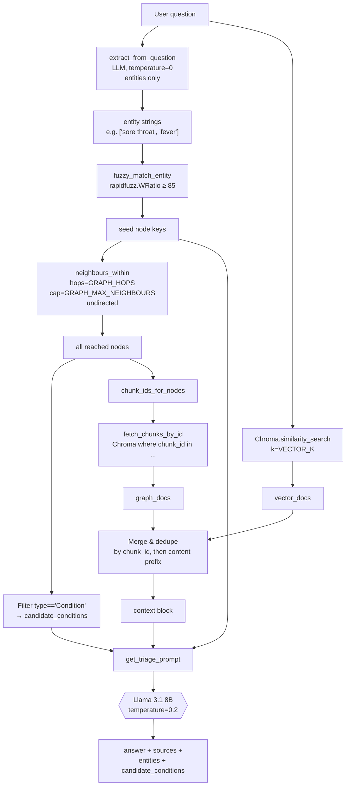
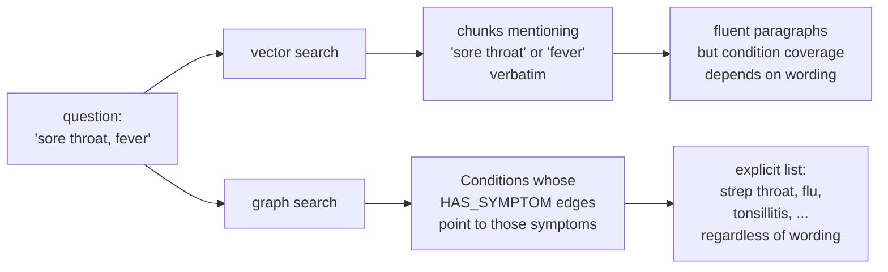
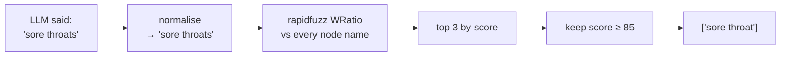
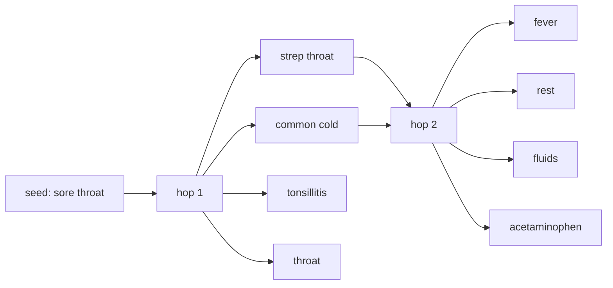
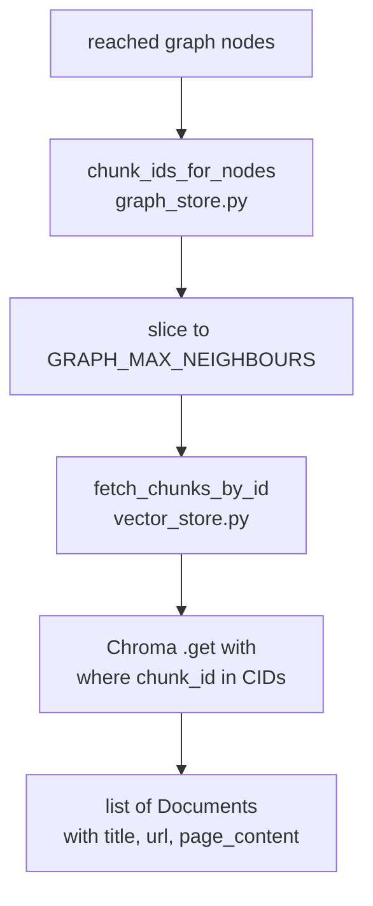

# Phase 3 — Hybrid Retrieval + RAG Chain

**Duration:** Weeks 5–7 (around 10–14 hours of focused work per person)
**Goal:** Combine the knowledge graph from Phase 2 with vector similarity search over Chroma, feed the merged context into the triage prompt, and produce grounded answers from a single CLI command. By the end of this phase the project's GraphRAG pipeline runs end-to-end on the command line — no API and no frontend yet, but every retrieval and prompting decision that determines answer quality is in place.

Retrieval quality measured in Phase 5 will trace back to choices made here: which entities the question-side extractor finds, how aggressively the graph is walked, and how the triage prompt frames the LLM's job.

---

## Table of Contents

1. [Overview](#1-overview)
2. [Definition of "done"](#2-definition-of-done)
3. [Time budget](#3-time-budget)
4. [Working principles](#4-working-principles)
5. [The retrieval pipeline at a glance](#5-the-retrieval-pipeline-at-a-glance)
6. [Why hybrid beats vector-only](#6-why-hybrid-beats-vector-only)
7. [Step 1 — Read `retriever.py`](#7-step-1--read-retrieverpy)
8. [Step 2 — Concept: fuzzy entity matching](#8-step-2--concept-fuzzy-entity-matching)
9. [Step 3 — Concept: BFS over the graph](#9-step-3--concept-bfs-over-the-graph)
10. [Step 4 — The chunk_id bridge from graph to Chroma](#10-step-4--the-chunk_id-bridge-from-graph-to-chroma)
11. [Step 5 — Test entity matching and traversal in a REPL](#11-step-5--test-entity-matching-and-traversal-in-a-repl)
12. [Step 6 — Read `graph_rag.py`](#12-step-6--read-graph_ragpy)
13. [Step 7 — Read the triage prompt](#13-step-7--read-the-triage-prompt)
14. [Step 8 — Run the CLI end-to-end](#14-step-8--run-the-cli-end-to-end)
15. [Step 9 — Tune retrieval parameters](#15-step-9--tune-retrieval-parameters)
16. [Step 10 — Refine the triage prompt](#16-step-10--refine-the-triage-prompt)
17. [Step 11 — Capture sample runs](#17-step-11--capture-sample-runs)
18. [Common errors and how to fix them](#18-common-errors-and-how-to-fix-them)
19. [Definition of Done — checklist](#19-definition-of-done--checklist)
20. [Demo](#20-demo)
21. [What's next](#21-whats-next)

---

## 1. Overview

Phase 3 covers the **answer pipeline** — everything between the user's typed question and the LLM's reply:

- Extracting the medical entities the user mentioned (entities-only, lighter prompt than Phase 2's extraction).
- Fuzzy-matching those entities against the graph's node names.
- Walking the graph 1–2 hops to find related conditions, body parts, treatments.
- Pulling the source chunks linked to those graph nodes from Chroma.
- Separately, running a plain vector similarity search on the raw question.
- Merging the two streams (graph hits first, then vector hits, de-duped).
- Feeding the merged context into the triage prompt and calling the LLM.
- Returning the answer plus the matched entities, candidate conditions, and source titles.

Almost no new code is written. The work is reading the three skeleton files, calling them from a REPL, observing how each parameter changes retrieval, and iterating on the triage prompt.

### 1.1 Skeleton files read (not modified)

These files already exist in the repo and are read carefully during this phase:

| File | Purpose |
|---|---|
| `backend/app/services/retriever.py` | Hybrid retriever class — orchestrates graph + vector + merge |
| `backend/app/services/graph_rag.py` | End-to-end `answer(question)` function and the `__main__` CLI |
| `backend/app/services/prompts.py` | `TRIAGE_SYSTEM` / `TRIAGE_USER` and the `QUERY_ENTITY_*` prompts |
| `backend/app/services/embeddings.py` | Ollama `nomic-embed-text` wrapper |
| `backend/app/services/vector_store.py` | Chroma load + `fetch_chunks_by_id` (the graph→Chroma bridge) |
| `backend/app/services/llm.py` | `ChatOllama` wrapper with the temperature contract |
| `backend/app/services/graph_store.py` | Re-read `fuzzy_match_entity` and `neighbours_within` (used heavily this phase) |
| `backend/app/config.py` | `VECTOR_K`, `GRAPH_HOPS`, `GRAPH_MAX_NEIGHBOURS` |

### 1.2 Artifacts produced in this phase

| Path | Created by | Purpose |
|---|---|---|
| `examples/sample_runs.md` | Team writes | The Phase 3 written deliverable — 5 end-to-end Q&A captures |
| `notebooks/02_retrieval_inspection.ipynb` *(optional)* | Team writes | Scratch notebook for entity-matching and merge inspection |
| Updates to `.env` | Team edits | Tuned values of `VECTOR_K`, `GRAPH_HOPS`, `GRAPH_MAX_NEIGHBOURS` |
| Possible edits to `prompts.py` | Team edits | Triage prompt refinements (red flags, refusal, citation format) |

No new on-disk artifacts beyond `examples/sample_runs.md`. The graph and Chroma collection from Phase 2 are loaded read-only.

---

## 2. Definition of "done"

By the end of Phase 3, each team member should be able to:

- Open `retriever.py` and recite the order of operations: entity extraction → fuzzy match → BFS → chunk lookup → vector search → merge.
- Explain what `fuzzy_match_entity` does and why `threshold=85` is the default.
- Explain why the BFS in `neighbours_within` treats the graph as undirected even though edges are typed and directed.
- Explain how a node in the graph leads back to a chunk in Chroma (the `source_chunk_ids` → `fetch_chunks_by_id` bridge).
- Run `python -m backend.app.services.graph_rag "I have a sore throat and mild fever for two days"` from the project root and read the four-section CLI output.
- Change `VECTOR_K`, `GRAPH_HOPS`, or `GRAPH_MAX_NEIGHBOURS` in `.env` and describe the observable effect on retrieval.
- Identify one weakness in the triage prompt and propose a one-line edit that improves it.
- Recite the six numbered rules in `TRIAGE_SYSTEM`.

The API, the frontend, and any quantitative evaluation are **not** built in this phase.

---

## 3. Time budget

Per person, spread across three weeks:

| Task | Time |
|---|---|
| Read `retriever.py` and `graph_rag.py` | 90 min |
| Read the triage prompt and re-read `prompts.py` | 30 min |
| Step 5 REPL experiments with matching + BFS | 90 min |
| Step 8 CLI runs on 10+ questions | 60 min |
| Step 9 parameter tuning | 90 min |
| Step 10 triage prompt refinements | 90 min |
| Step 11 sample-run capture | 60 min |
| Team review and small fixes | 1–2 hours |
| Buffer | 1–2 hours |
| **Total** | **~10–12 hours** |

---

## 4. Working principles

**1. Read the intermediate results, not just the final answer.** The pipeline returns four things — `answer`, `entities`, `candidate_conditions`, `sources`. When an answer looks wrong, the cause is usually visible one stage earlier. Always inspect the matched entities and candidate conditions before blaming the LLM.

**2. Change one parameter at a time.** `VECTOR_K`, `GRAPH_HOPS`, `GRAPH_MAX_NEIGHBOURS`, the matching threshold, and the prompt all interact. Bisect cleanly — change one, re-run the same five questions, compare.

**3. Trust the graph; constrain the LLM.** The graph hits are derived from extracted facts; the LLM is good at fluent language but invents conditions. The triage prompt's job is to keep the answer on the rails of the retrieved context. When in doubt, tighten the prompt rather than loosening retrieval.

---

## 5. The retrieval pipeline at a glance



Two outputs matter most:

- **The printed CLI sections** — `=== ANSWER ===`, `=== SYMPTOMS MATCHED ===`, `=== CANDIDATE CONDITIONS ===`, `=== SOURCES ===`. These are the team's debugging dashboard for the whole phase.
- **`examples/sample_runs.md`** — five captured runs that demonstrate the pipeline works on a range of inputs (symptom triage, single-condition question, off-topic question, red-flag question, ambiguous question).

---

## 6. Why hybrid beats vector-only

A vector store retrieves *text similar to the question text*. A graph retrieves *concepts related to the question's concepts*. For symptom triage these are not the same thing.



Concrete example. The query *"my throat hurts when I swallow"* may produce vector hits for any MedlinePlus chunk that says "sore throat" — but the LLM still has to *infer* which conditions involve that symptom. The graph already encodes that inference: starting from the `sore throat` node, one hop along `HAS_SYMPTOM` reaches `strep throat`, `tonsillitis`, `common cold`, etc. Those Conditions are then surfaced as `candidate_conditions` in the prompt.

A small experiment to make the difference visible (run after Step 8 works):

```python
from backend.app.services.retriever import get_retriever

r = get_retriever()
result = r.retrieve("my throat hurts when I swallow")
print("matched_entities:    ", result.matched_entities)
print("candidate_conditions:", result.candidate_conditions)
print("graph_hits:          ", result.graph_hits)
print("vector_hits:         ", result.vector_hits)
```

If `candidate_conditions` is empty but `vector_hits` is 4, the graph side is dead — that is the failure mode "hybrid is worse than vector-only" warned about in `GUIDE.md` §18.

---

## 7. Step 1 — Read `retriever.py`

Open **`backend/app/services/retriever.py`** (~93 lines) and read it end to end.

Five things to notice:

1. **Module-level singleton.** `_retriever` is cached so the graph pickle and Chroma directory are only loaded once. In Phase 4 the FastAPI lifespan handler calls `get_retriever()` at startup to pay this cost before the first request.

2. **`RetrievalResult` is a dataclass with five fields.** Two of them (`matched_entities`, `candidate_conditions`) are passed through to the prompt; two more (`graph_hits`, `vector_hits`) are diagnostic counters. Surfacing both kinds of state is intentional.

3. **Seeds are deduplicated while preserving order.** `list(dict.fromkeys(seeds))` — Python's dict-as-ordered-set idiom. Order matters because BFS frontier order affects which neighbours get included when the cap is hit.

4. **Candidate conditions are filtered by node type.** Only nodes whose `type == "Condition"` are surfaced for the prompt's `candidate_conditions` field. Symptoms and body parts also reach the prompt — but only through the chunk context, not as a structured list.

5. **The graph chunk lookup is capped twice.** Once by `GRAPH_MAX_NEIGHBOURS` on the BFS itself, and a second time by `graph_chunk_ids[:GRAPH_MAX_NEIGHBOURS]` on the chunk-id slice before hitting Chroma. The second cap matters because a single node can contribute many chunk ids; without it, a popular entity could swamp the context.

Add a `# Read 2026-05-XX` comment to the top of the file.

---

## 8. Step 2 — Concept: fuzzy entity matching

The question-side LLM returns lowercase strings like `"sore throat"` or `"sore throats"` or `"sore-throat"`. The graph has its own normalised key. A direct equality check would miss almost every match.

`fuzzy_match_entity` in `graph_store.py` uses **`rapidfuzz.WRatio`** — a weighted combination of several string-similarity scores tuned for short labels. It returns up to `limit=3` graph node keys whose WRatio score is at least `threshold=85`.



Why **85**? Empirically, that threshold:

- Catches `"sore throat"` ↔ `"sore throats"` (small plural / spacing variants).
- Catches typos like `"heart attck"`.
- Rejects `"sore throat"` ↔ `"sore eye"` (which scores around 60–70).

A lower threshold (70) starts pulling in semantically wrong matches; a higher threshold (95) misses common variants. Default `85` is a reasonable balance for the MVP.

The matcher is called once per LLM-extracted entity; matches are unioned and de-duped to form the `seeds` list.

---

## 9. Step 3 — Concept: BFS over the graph

`neighbours_within(g, seeds, hops, max_neighbours)` is a bounded breadth-first traversal that treats the graph as **undirected**. Read its body in `graph_store.py`:

```python
for neighbour in list(g.successors(n)) + list(g.predecessors(n)):
```

Both directions are followed. Two practical reasons:

1. **Edges in the schema point one way.** `Condition HAS_SYMPTOM Symptom` is a forward edge. The user mentions a symptom; we want to walk *backwards* to the condition. Forcing the BFS to follow `predecessors` as well as `successors` makes that traversal trivial.

2. **Retrieval is about reachability, not causality.** At answer time, "which chunks are about anything related to the user's symptoms?" is the right question. Edge direction is informative for the LLM (it appears in the context), but not for the walk itself.

Why **1–2 hops**? One hop reaches the most directly related concepts: from `sore throat` to `strep throat`, `common cold`, `tonsillitis`, `throat`. Two hops adds *those conditions' other symptoms and treatments*. Three hops starts pulling in unrelated material — the graph is connected enough that a 3-hop ball around almost any symptom touches most of the corpus.

`max_neighbours` (default 20) caps total expansion. The implementation breaks out of the inner loop the moment the cap is reached, so the result is a reasonable but not strictly deterministic subset of the 1–2 hop ball.



---

## 10. Step 4 — The chunk_id bridge from graph to Chroma

The graph stores concepts. Chroma stores text chunks. Neither is useful in isolation for the prompt — the prompt wants *text passages that the LLM can quote*. The bridge is the `source_chunk_ids` list on every graph node, populated during Phase 2's ingestion.

The flow:



Two implementation details worth knowing:

- **`fetch_chunks_by_id` uses `vs.get`, not `similarity_search`.** Chroma supports a metadata `$in` filter on `.get`, which is a direct lookup — no embedding involved, no scoring. This is the only place in the system where Chroma is queried by id instead of by vector.

- **Chroma reads expect lists in batch.** A single `.get(where={"chunk_id": {"$in": [...]}})` returns parallel `documents` and `metadatas` lists, which the helper zips into `Document` objects. There is no per-id round trip.

This is the most-asked design question of the project: *"How does the graph know about Chroma?"* The answer is: it doesn't. Each node carries the *ids* of the chunks that minted it during ingestion, and Chroma can be queried for those ids by anyone.

---

## 11. Step 5 — Test entity matching and traversal in a REPL

Before running the full CLI, exercise the pieces in isolation. From the project root, backend venv active, Ollama running, with the graph and Chroma already built from Phase 2:

```python
from backend.app.services.graph_store import (
    load_graph, fuzzy_match_entity, neighbours_within, chunk_ids_for_nodes
)
from backend.app.services.entity_extractor import extract_from_question

g = load_graph()
print(f"graph: {g.number_of_nodes()} nodes, {g.number_of_edges()} edges")

# 1. Question-side entity extraction
q = "I have a sore throat and mild fever for two days. What could it be?"
ents = extract_from_question(q)
print("entities from LLM:", ents)

# 2. Fuzzy match each entity to graph nodes
seeds = []
for e in ents:
    matches = fuzzy_match_entity(g, e)
    print(f"  {e!r} → {matches}")
    seeds.extend(matches)
seeds = list(dict.fromkeys(seeds))

# 3. BFS 1 hop, then 2 hops, compare
for hops in (1, 2):
    reached = neighbours_within(g, seeds, hops=hops, max_neighbours=20)
    types = {g.nodes[n]["type"] for n in reached}
    conds = [n for n in reached if g.nodes[n]["type"] == "Condition"]
    print(f"hops={hops}  reached={len(reached)}  types={types}  conditions={conds[:5]}")

# 4. Chunk ids reached at hops=2
reached2 = neighbours_within(g, seeds, hops=2, max_neighbours=20)
cids = chunk_ids_for_nodes(g, reached2)
print(f"chunk ids: {len(cids)}; first 3 = {cids[:3]}")
```

Try at least three questions:

- A clean symptom triage: *"sore throat, fever, runny nose"*.
- A condition by name: *"how do you treat strep throat?"*.
- An off-topic question: *"what is the capital of France?"*. `extract_from_question` should return `[]` and `seeds` should be empty.

> ✅ **Checkpoint — pipeline pieces wired.** If `seeds` is non-empty for the first two questions and empty for the third, every component up to the LLM works. If `seeds` is empty for question 1, either the LLM extraction is failing (check Ollama) or the fuzzy threshold is too tight for the graph's vocabulary (try lowering to 80 in a one-off call to confirm).

---

## 12. Step 6 — Read `graph_rag.py`

Open **`backend/app/services/graph_rag.py`** (~100 lines).

The whole file is short. Read it end to end. Three points:

1. **`answer(question)` is the single public entry point.** It runs the retriever, formats the context, invokes the triage chain, and returns a TypedDict with `answer`, `sources`, `entities`, and `candidate_conditions`. Phase 4's FastAPI route is one line: `return answer(req.message)`.

2. **`_format_docs` numbers and titles the context.** Each retrieved chunk is rendered as `[i] Title\n<content>` with `---` separators. The numbering helps the LLM produce "Sources: …" lines that reference the right titles; the title-on-its-own-line is what the prompt's citation rule keys off.

3. **`warmup()` is called by FastAPI's lifespan in Phase 4.** It pre-loads the retriever and pings the LLM with a one-token prompt so the *first* `/chat` request doesn't pay the cold-load cost. `FileNotFoundError` is swallowed — if the graph isn't built yet, the backend still starts and `/health` reports the missing artifact.

The `__main__` block at the bottom is the Phase 3 CLI. It accepts the question as `sys.argv[1:]` joined with spaces, falls back to a default question, and prints the four labelled sections.

Add the `# Read 2026-05-XX` comment.

---

## 13. Step 7 — Read the triage prompt

Open **`backend/app/services/prompts.py`** and re-read `TRIAGE_SYSTEM` (~25 lines) and `TRIAGE_USER` (~10 lines).

The six numbered rules in `TRIAGE_SYSTEM`:

| # | Rule | Why it's there |
|---|---|---|
| 1 | Use ONLY the CONTEXT | The single biggest lever against hallucinated medical claims. |
| 2 | Red-flag symptoms → emergency-care notice **first** | The bot must not give a calm differential while the user describes a stroke. This rule trumps everything else. |
| 3 | Always end with "consult a doctor" | Legal / ethical guardrail, in line with §16 of the GUIDE. |
| 4 | Cite source titles at the end | Makes hallucinations falsifiable — the user can click through. |
| 5 | Concise, calm, easy to read | Without this, Llama 3.1 produces dense walls of text. |
| 6 | Never invent drug dosages | Naming `ibuprofen` is fine; saying `400 mg every 6 hours` is not, unless the context says so. |

The user-side template (`TRIAGE_USER`) injects three pieces of structured state alongside the question:

```
CONTEXT (retrieved from the knowledge base):
{context}

SYMPTOMS MATCHED IN THE QUESTION: {entities}
CANDIDATE CONDITIONS (from graph traversal — discuss only those also supported by the context above): {candidate_conditions}

USER QUESTION:
{question}
```

The "(discuss only those also supported by the context above)" clause is the bridge between graph traversal and prompt safety. The graph can over-reach; the context grounds it. This phrasing is what Phase 5's *condition-grounding rate* metric (§16 of the GUIDE) will measure against.

---

## 14. Step 8 — Run the CLI end-to-end

This is the Phase 3 deliverable command. From the project root, backend venv active, Ollama running, with the graph and Chroma already built:

```bash
python -m backend.app.services.graph_rag "I have a sore throat and mild fever for two days. What could it be?"
```

Expected output (abridged):

```
=== ANSWER ===

Based on the symptoms you describe — sore throat and mild fever lasting two days —
possible conditions include:
- Strep throat
- Common cold
- Tonsillitis

Typical self-care from the retrieved sources: rest, drink fluids, saltwater gargle.
...
When to see a doctor immediately: difficulty breathing or swallowing, severe ...
Please consult a doctor for proper diagnosis.

Sources: Sore Throat; Strep Throat; Tonsillitis

=== SYMPTOMS MATCHED ===
['sore throat', 'fever']

=== CANDIDATE CONDITIONS (from graph) ===
['strep throat', 'common cold', 'tonsillitis', ...]

=== SOURCES ===
- Sore Throat  https://medlineplus.gov/sorethroat.html
- Strep Throat  https://medlineplus.gov/streptthroat.html
- Tonsillitis  https://medlineplus.gov/tonsillitis.html
```

> ✅ **Checkpoint — end-to-end pipeline works.** If all four sections print and the `=== CANDIDATE CONDITIONS ===` list is non-empty for a symptom-triage question, the GraphRAG pipeline is wired correctly. First invocation may take 30–60 s (cold load + cold Ollama). Subsequent invocations within the same process do *not* benefit from the singleton — the CLI is a fresh process every time. Phase 4's API run will be much faster after the first request.

Try at least five different questions during this step. Note in a scratch file:
- Which entities the LLM extracted.
- Which conditions surfaced as candidates.
- Whether the answer mentions any condition *not* in the candidates list (a grounding miss).

---

## 15. Step 9 — Tune retrieval parameters

Three knobs in `.env` (defaults shown live in `backend/app/config.py`):

| Variable | Default | What raising it does | What lowering it does |
|---|---|---|---|
| `VECTOR_K` | 4 | More vector hits; broader context, possibly off-topic chunks | Sharper vector hits; risk of missing relevant text |
| `GRAPH_HOPS` | 2 | Larger traversal ball; more candidate conditions, more noise | Tighter focus; may miss treatments / risk factors |
| `GRAPH_MAX_NEIGHBOURS` | 20 | More graph-side chunks reach the prompt; may dilute vector signal | Smaller graph slice; prompt becomes vector-dominated |

Pick a held-out fixed question (e.g. *"sore throat, fever, runny nose"*) and run the CLI four times with these settings, each time editing `.env`:

```env
# Run A: baseline
VECTOR_K=4
GRAPH_HOPS=2
GRAPH_MAX_NEIGHBOURS=20

# Run B: vector-heavy
VECTOR_K=8
GRAPH_HOPS=1
GRAPH_MAX_NEIGHBOURS=10

# Run C: graph-heavy
VECTOR_K=2
GRAPH_HOPS=2
GRAPH_MAX_NEIGHBOURS=40

# Run D: minimal
VECTOR_K=2
GRAPH_HOPS=1
GRAPH_MAX_NEIGHBOURS=10
```

Compare:
- Length and specificity of the answer.
- Number of candidate conditions surfaced.
- Whether sources include irrelevant titles.

There is no universally right setting. The MVP defaults are the recommended starting point; revisit during Phase 5 evaluation.

> ⚠️ **Restart the Python process between runs.** `.env` is read once at import via `python-dotenv` and `os.getenv`. The CLI is a fresh process each invocation, so this happens automatically — but inside a Jupyter notebook or REPL session, edits to `.env` will *not* take effect without a kernel restart.

---

## 16. Step 10 — Refine the triage prompt

Open `prompts.py`. Run the same five questions through the CLI before and after each change.

Common one-line edits that move quality:

| Observed weakness | Edit to make |
|---|---|
| Bot recites every retrieved chunk verbatim | Tighten rule 5: *"Use at most 3 short bullet points per section."* |
| Bot names conditions not in candidate_conditions | Strengthen rule 1: *"Do not name a condition that is not in the CANDIDATE CONDITIONS list above."* |
| Red-flag clause arrives at the *end* of the answer | Strengthen rule 2: *"If red-flag symptoms are present, the FIRST line of your answer must be the emergency-care notice."* |
| Citations are missing or mis-titled | Strengthen rule 4: *"Cite by exact title as it appears in the CONTEXT, e.g. `[1] Sore Throat`."* |
| Bot dispenses dose advice | Add: *"Never include numbers, frequencies, or strengths for medications."* |

Commit each prompt change on a branch `feature/triage-prompt-vN`. Smaller, isolated changes are easier to review.

Do **not** change `temperature` for the triage LLM. The 0.2 default in `get_llm()` is intentionally non-zero so the answer reads naturally; raising it makes the bot more creative (bad), lowering it to 0 makes it robotic.

---

## 17. Step 11 — Capture sample runs

Create **`examples/sample_runs.md`** at the project root. This is the Phase 3 written deliverable.

Capture **five** end-to-end runs, one per scenario:

1. **Clear symptom triage.** *"I have a sore throat and mild fever for two days. What could it be?"*
2. **Condition by name.** *"What are the treatments for tonsillitis?"*
3. **Red-flag.** *"I have sudden chest pain and trouble breathing."* The first line of the answer should be the emergency-care notice.
4. **Ambiguous / vague.** *"I feel sick."* The bot should ask for more detail or note the context is insufficient.
5. **Off-topic.** *"What is the capital of France?"* The bot should refuse to answer outside the medical context.

For each, paste the **full** CLI output — answer, matched entities, candidate conditions, sources — under a level-2 heading. Add a short prose paragraph noting:
- whether the answer is grounded in the retrieved sources,
- any conditions the bot named that were not in `candidate_conditions`,
- any retrieval issue worth flagging for Phase 5.

Example skeleton:

```markdown
## 1. Sore throat + fever

**Question:** I have a sore throat and mild fever for two days. What could it be?

```
=== ANSWER ===
...

=== SYMPTOMS MATCHED ===
['sore throat', 'fever']

=== CANDIDATE CONDITIONS (from graph) ===
['strep throat', 'common cold', 'tonsillitis']

=== SOURCES ===
- Sore Throat  https://medlineplus.gov/sorethroat.html
- ...
```

**Observations:** Answer mentions three conditions, all in candidates list. Red-flag clause appears. Citations match retrieved titles. ✅
```

The file should end up around 400–800 lines and is the primary artifact the team reviews together at the end of the phase.

---

## 18. Common errors and how to fix them

### `FileNotFoundError: Graph not built. Expected at .../kg.pickle`
Phase 2 was not run on this machine. Run `python -m backend.scripts.ingest` (no flags) to build both the graph and Chroma.

### `chromadb.errors.InvalidCollectionException` or empty `similarity_search` results
The Chroma collection was not built or is empty. Confirm `data/chroma/` exists and is not empty (it should contain a `chroma.sqlite3` and a folder per collection). If empty, re-run ingestion.

### `=== SYMPTOMS MATCHED ===` is always empty
`extract_from_question` is returning `[]`. Run it directly in a REPL (Step 5) and print the raw LLM output. Most likely cause: Ollama is dropping the request or the model is producing non-JSON. Re-pull `llama3.1:8b` and confirm `ollama run llama3.1:8b "ok"` works.

### `=== CANDIDATE CONDITIONS ===` is empty but `SYMPTOMS MATCHED` is non-empty
The fuzzy threshold is rejecting matches. Lower `threshold=85` to `80` in a one-off call from a REPL to confirm. If matches appear, the question's vocabulary doesn't line up with the graph's — the long-term fix is in Phase 5 (extend extraction prompts, normalise plurals).

### The bot names conditions not in `candidate_conditions`
The LLM is using its own medical priors despite rule 1. Strengthen the prompt with the "Do not name a condition that is not in the CANDIDATE CONDITIONS list above" edit (Step 10).

### Answer is empty or `(no relevant context found)`
Both graph_docs and vector_docs are empty. Either the question is far outside the corpus (acceptable — the bot should refuse) or Chroma is empty. Check with `from backend.app.services.vector_store import load_vector_store; load_vector_store().similarity_search("fever", k=2)`.

### `OllamaError: timed out`
First call to `llama3.1:8b` after a cold start can take 30–60 s. Subsequent calls in the same Ollama session are fast. Increase the LangChain HTTP timeout only if calls are taking > 2 minutes — usually the real cause is memory pressure forcing the OS to swap. Switch to `phi3:mini`.

### Sources list contains duplicate titles
Same title from multiple chunks should already be collapsed by `_dedupe_sources`. If duplicates appear, `metadata["title"]` is inconsistent between chunks (e.g. a trailing space). Inspect the offending records in `data/medlineplus_clean.jsonl` and re-ingest if needed.

### Changing `.env` has no effect
`.env` is loaded at import time. The CLI re-imports on every invocation, so it works there. In a REPL or notebook, restart the kernel.

---

## 19. Definition of Done — checklist

Phase 3 is complete when, as a team, all of the following are true:

- [ ] Every team member has read `retriever.py`, `graph_rag.py`, and the triage prompt and added the *Read* comment.
- [ ] Step 5 has been run successfully on at least three different questions, with the REPL output captured in the team channel.
- [ ] `python -m backend.app.services.graph_rag "..."` returns a non-empty answer for at least five different questions.
- [ ] `=== CANDIDATE CONDITIONS ===` is non-empty for at least four of the five questions in `examples/sample_runs.md`.
- [ ] For the red-flag question in `sample_runs.md`, the emergency-care notice appears on the first line of the answer.
- [ ] The parameter-tuning experiment (Step 9) has been run at the defaults and one alternative setting, with results discussed.
- [ ] At least one prompt-tuning PR has been opened on a `feature/triage-prompt-*` branch and reviewed.
- [ ] `examples/sample_runs.md` exists, has five sections, and is committed.
- [ ] No team member observes the bot inventing condition names not in `candidate_conditions` for the symptom-triage question.
- [ ] The off-topic question produces a refusal, not a hallucinated answer.
- [ ] At least one PR has been opened and merged into `main`.
- [ ] *(Optional)* `notebooks/02_retrieval_inspection.ipynb` exists with the Step 5 experiments captured.

---

## 20. Demo

End-of-Week-7 walkthrough (15–20 minutes):

1. **Whiteboard the pipeline diagram** from Section 5. Each team member explains one stage.
2. **Run Step 5 live in a REPL** — show entity extraction, fuzzy matching, and BFS results for one symptom-triage question.
3. **Run the CLI live** on three questions: clear triage, red-flag, off-topic. Read all four output sections aloud.
4. **Show `examples/sample_runs.md`** scrolled in the editor; pick one captured run and discuss its observations paragraph.
5. **Show one prompt edit** that meaningfully changed the bot's behaviour — diff the prompt, run before/after on the same question.
6. **Q&A on tradeoffs** — what would `GRAPH_HOPS=3` change, why is fuzzy threshold 85, when should the bot refuse?

Each member should present at least one section.

---

## 21. What's next

**Phase 4 (Weeks 8–9)** wraps everything in this phase behind an HTTP API and connects a Streamlit chat UI.

- `backend/app/main.py` will call `warmup()` (from `graph_rag.py`) during the FastAPI lifespan, so the first `/chat` request is fast.
- `backend/app/api/routes.py` will expose `/health` and `/chat`. The `/chat` handler is essentially `answer(req.message)` — every behavioural decision (entity extraction, hybrid retrieval, triage prompt) was already made in this phase.
- `backend/app/schemas.py` defines the request/response shapes, including `candidate_conditions` — the same field surfaced in this phase's CLI output. Phase 5's *condition-grounding rate* metric depends on it.
- `frontend/app.py` will be a Streamlit chat UI that POSTs to the backend and renders the answer plus citations.

Two reads to do before Phase 4 starts:

- `backend/app/main.py` and `backend/app/api/routes.py` — note how `answer()` is wired in.
- `backend/app/schemas.py` — note that `ChatResponse` mirrors the `RagResult` TypedDict returned by `answer()`.

Skimming these now will turn Phase 4's first day from a cold start into a guided tour.
