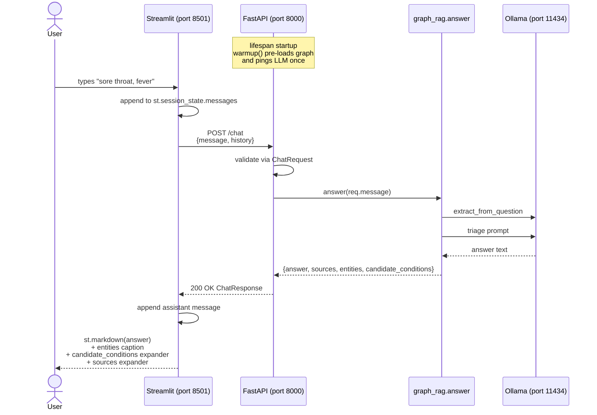
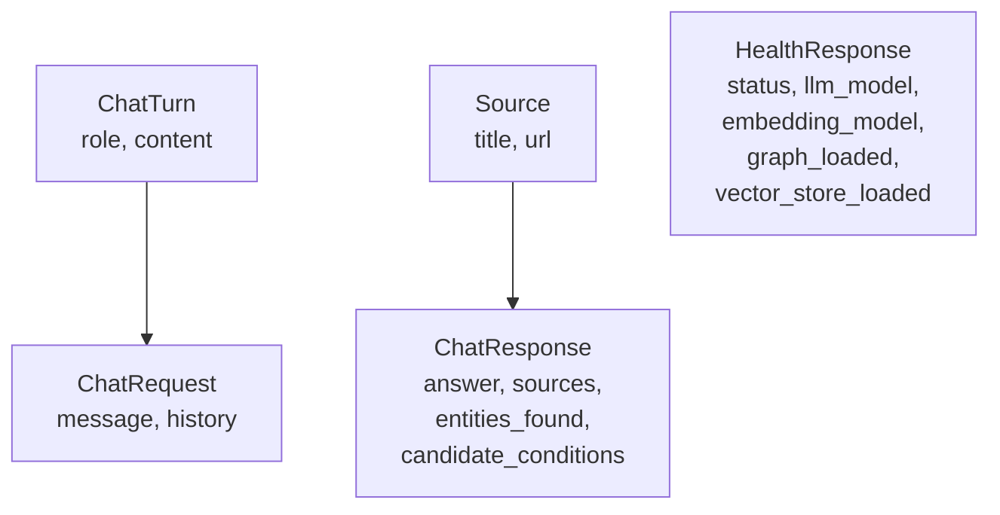
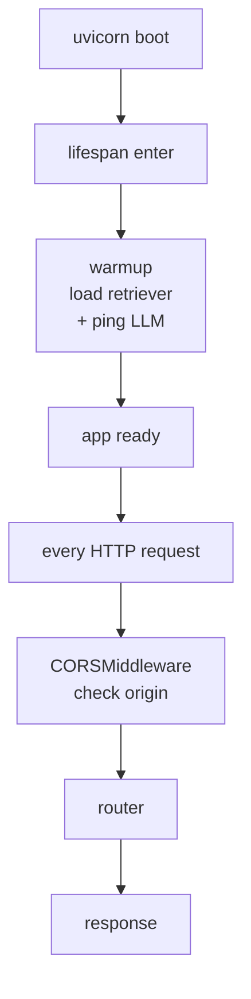
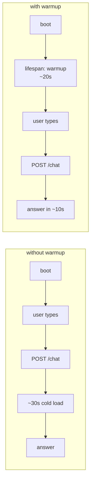
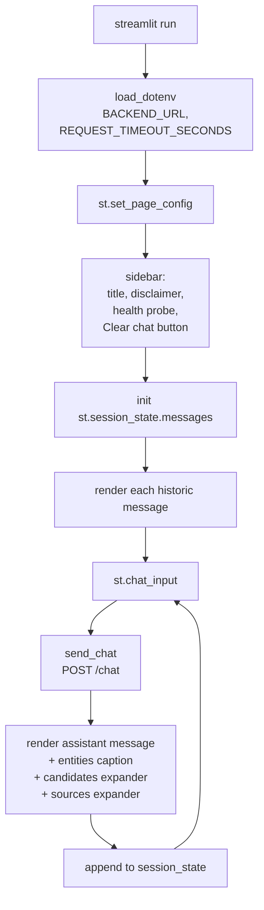

# Phase 4 — Backend API + Frontend Integration

**Duration:** Weeks 8–9 (around 8–12 hours of focused work per person)
**Goal:** Expose the GraphRAG pipeline from Phase 3 as an HTTP service with FastAPI, and connect a Streamlit chat UI to it. By the end of this phase the project is a runnable web app: a user opens a browser, types a symptom in a chat box, and receives an answer with citations from the knowledge base — over a real HTTP boundary, with no Python coupling between the two halves.

Almost no ML code is written here. The work is about contracts: the JSON request/response shape, CORS, lifecycle, and graceful degradation when the backend is down.

---

## Table of Contents

1. [Overview](#1-overview)
2. [Definition of "done"](#2-definition-of-done)
3. [Time budget](#3-time-budget)
4. [Working principles](#4-working-principles)
5. [The request flow at a glance](#5-the-request-flow-at-a-glance)
6. [The API contract](#6-the-api-contract)
7. [Step 1 — Read `schemas.py`](#7-step-1--read-schemaspy)
8. [Step 2 — Read `routes.py`](#8-step-2--read-routespy)
9. [Step 3 — Read `main.py`](#9-step-3--read-mainpy)
10. [Step 4 — Concept: CORS, lifespan, and warmup](#10-step-4--concept-cors-lifespan-and-warmup)
11. [Step 5 — Start the backend and open `/docs`](#11-step-5--start-the-backend-and-open-docs)
12. [Step 6 — Test `/chat` with curl](#12-step-6--test-chat-with-curl)
13. [Step 7 — Read `frontend/app.py`](#13-step-7--read-frontendapppy)
14. [Step 8 — Concept: Streamlit chat state](#14-step-8--concept-streamlit-chat-state)
15. [Step 9 — Start the frontend](#15-step-9--start-the-frontend)
16. [Step 10 — Test the round trip in the browser](#16-step-10--test-the-round-trip-in-the-browser)
17. [Step 11 — Test graceful degradation](#17-step-11--test-graceful-degradation)
18. [Step 12 — Record the demo](#18-step-12--record-the-demo)
19. [Common errors and how to fix them](#19-common-errors-and-how-to-fix-them)
20. [Definition of Done — checklist](#20-definition-of-done--checklist)
21. [Demo](#21-demo)
22. [What's next](#22-whats-next)

---

## 1. Overview

Phase 4 covers the **service layer** — every line of code between the user's browser and the `answer(question)` function built in Phase 3:

- A FastAPI app exposing `GET /health` and `POST /chat`.
- Pydantic request/response models (the API contract).
- CORS middleware so a Streamlit page on port 8501 can call an API on port 8000.
- A lifespan handler that pre-loads the retriever and pings the LLM at startup so the first request is fast.
- A Streamlit chat UI that maintains session state, renders citations, and degrades gracefully when the backend is unreachable.

No new ML logic is added. The GraphRAG pipeline is treated as a black box that returns `{answer, sources, entities, candidate_conditions}`.

### 1.1 Skeleton files read (not modified)

These files already exist in the repo and are read carefully during this phase:

| File | Purpose |
|---|---|
| `backend/app/main.py` | FastAPI entrypoint, lifespan handler, CORS middleware |
| `backend/app/api/routes.py` | `/health` and `/chat` route handlers |
| `backend/app/schemas.py` | Pydantic models: `ChatRequest`, `ChatResponse`, `HealthResponse`, `Source`, `ChatTurn` |
| `backend/.env.example` | Backend env vars: Ollama URL, models, retrieval knobs, `ALLOWED_ORIGINS` |
| `frontend/app.py` | Streamlit chat UI — the only file in `frontend/` |
| `frontend/.env.example` | `BACKEND_URL`, `REQUEST_TIMEOUT_SECONDS` |
| `frontend/requirements.txt` | `streamlit`, `requests`, `python-dotenv` |
| `backend/app/services/graph_rag.py` | Re-read `answer()` and `warmup()` from Phase 3 — these are what the API wraps |

### 1.2 Artifacts produced in this phase

| Path | Created by | Purpose |
|---|---|---|
| `backend/.env` | Team copies from `.env.example` | Local backend config (already done in Phase 0, confirm values for `ALLOWED_ORIGINS`) |
| `frontend/.env` | Team copies from `.env.example` | Local frontend config (`BACKEND_URL`) |
| Recorded demo (2 min video / GIF) | Team records | The Phase 4 deliverable |
| `tests/test_api.py` *(optional)* | Team writes | httpx + pytest smoke tests against `/health` and `/chat` |
| `examples/curl_examples.md` *(optional)* | Team writes | A handful of `curl` requests for ad-hoc testing |

No new on-disk data artifacts are produced. The knowledge base from Phase 2 is loaded read-only at startup.

---

## 2. Definition of "done"

By the end of Phase 4, each team member should be able to:

- Open `routes.py` and explain in one sentence what `/health` and `/chat` each do.
- Open `schemas.py` and recite the fields of `ChatRequest` and `ChatResponse`.
- Start the backend with `uvicorn backend.app.main:app --reload --port 8000` and open `http://localhost:8000/docs`.
- Send a working `POST /chat` from `curl` and read the JSON response.
- Start the frontend with `streamlit run frontend/app.py` and chat with the bot in the browser.
- Stop the backend mid-session and describe what the frontend shows.
- Explain why CORS is needed and which origin is whitelisted.
- Explain what `warmup()` does and which user-visible problem it solves.

Evaluation, prompt-grade metrics, and the final README are **not** built in this phase.

---

## 3. Time budget

Per person, spread across two weeks:

| Task | Time |
|---|---|
| Read `schemas.py`, `routes.py`, `main.py` | 60 min |
| Read `frontend/app.py` | 45 min |
| Start backend, explore `/docs` | 30 min |
| curl experiments against `/chat` | 60 min |
| Start frontend, chat round-trip | 60 min |
| Graceful-degradation testing | 30 min |
| Record demo | 30 min |
| *(Optional)* httpx + pytest smoke tests | 90 min |
| Team review and small fixes | 1–2 hours |
| Buffer | 1–2 hours |
| **Total** | **~8 hours** |

---

## 4. Working principles

**1. Test the backend with `curl` before touching the frontend.** Two unknowns at once is twice as hard. If the API is wrong, every frontend symptom is a red herring. The frontend is finished only when `curl` and the browser produce the same answer.

**2. The API contract is the boundary.** `ChatRequest` and `ChatResponse` are the only shared vocabulary between the two halves. Add a field to `ChatResponse`? Add it to the Streamlit renderer too, in the same PR. Mismatches between Pydantic and the Streamlit JSON-handling code are the most common Phase 4 bug.

**3. Be loud when the backend is unreachable.** A user typing a question and seeing nothing is worse than a user seeing "Couldn't reach the backend at http://localhost:8000". The frontend already handles this; do not strip the error branches.

---

## 5. The request flow at a glance



Two outputs matter most:

- **A live URL pair** — `http://localhost:8000` (the API, with auto-generated `/docs`) and `http://localhost:8501` (the chat UI). Both must work, separately and together.
- **A recorded demo** — a 2-minute screen capture or GIF showing the round trip: user types a symptom, the answer renders with the entities caption, candidate-conditions expander, and sources expander. This is the Phase 4 deliverable.

---

## 6. The API contract

Two endpoints. Both are defined in `backend/app/api/routes.py` and validated by Pydantic models in `backend/app/schemas.py`.

**`GET /health`** — no request body. Returns the runtime configuration plus two booleans indicating whether the knowledge base has been built:

```json
{
  "status": "ok",
  "llm_model": "llama3.1:8b",
  "embedding_model": "nomic-embed-text",
  "graph_loaded": true,
  "vector_store_loaded": true
}
```

`graph_loaded` is `True` if `data/graph/kg.pickle` exists on disk. `vector_store_loaded` is `True` if `data/chroma/` has at least one file. Both are file-system probes, not deep checks.

**`POST /chat`** — request:

```json
{
  "message": "I have a sore throat and mild fever for two days. What could it be?",
  "history": []
}
```

Response:

```json
{
  "answer": "Based on the symptoms you describe...",
  "sources": [
    {"title": "Sore Throat", "url": "https://medlineplus.gov/sorethroat.html"},
    {"title": "Strep Throat", "url": "https://medlineplus.gov/streptthroat.html"}
  ],
  "entities_found": ["sore throat", "fever"],
  "candidate_conditions": ["strep throat", "common cold", "tonsillitis"]
}
```

> 💡 **`history` is currently ignored by the backend.** The route accepts it and validates its shape (so the frontend can keep sending it), but `answer()` only takes `message`. Multi-turn memory is a stretch goal in `GUIDE.md` §19.

Error responses:

| Status | When |
|---|---|
| `422 Unprocessable Entity` | Pydantic validation failed — usually `message` is empty or longer than 2000 chars |
| `503 Service Unavailable` | `FileNotFoundError` from the retriever — the knowledge base isn't built |
| `500 Internal Server Error` | Anything else (Ollama down, unexpected exception) |

---

## 7. Step 1 — Read `schemas.py`

Open **`backend/app/schemas.py`** (~38 lines). The whole file is five Pydantic models.



Things to notice:

1. **`message` is validated.** `min_length=1, max_length=2000` — Pydantic rejects empty and over-long inputs with a 422 before they reach `answer()`.

2. **`candidate_conditions` is a first-class field.** It's not a debug log — it's part of the public response, named explicitly so Phase 5's *condition-grounding rate* eval has a stable place to read from. The comment in the file calls this out.

3. **Field name mismatch with `graph_rag.answer()`.** The Phase 3 `RagResult` uses `entities`; `ChatResponse` renames it to `entities_found`. The renaming happens in the route handler:
   ```python
   entities_found=result.get("entities", []),
   ```
   Mind this when matching up the two layers.

4. **`Source.url` defaults to `""`.** Some retrieved chunks may carry a title without a URL (rare, but possible). The frontend handles both cases.

Add a `# Read 2026-05-XX` comment.

---

## 8. Step 2 — Read `routes.py`

Open **`backend/app/api/routes.py`** (~40 lines). Two route handlers, both thin.

`/health` is a pure function — no exceptions to handle, just file-system probes plus the configured model names.

`/chat` is the only place where the GraphRAG pipeline is exposed:

```python
@router.post("/chat", response_model=ChatResponse)
def chat(req: ChatRequest) -> ChatResponse:
    try:
        result = answer(req.message)
    except FileNotFoundError as e:
        raise HTTPException(status_code=503, ...)
    except Exception as e:
        raise HTTPException(status_code=500, detail=str(e))
    return ChatResponse(...)
```

Three points:

1. **Route function is synchronous (`def`, not `async def`).** `answer()` does CPU-bound LLM work via blocking HTTP to Ollama. FastAPI runs sync route handlers in a threadpool so they don't block the event loop. Making it `async` here would actually be worse — the work would block the loop directly.

2. **`FileNotFoundError` → 503.** This is the "you didn't run ingestion" case. The error message includes the command to fix it.

3. **The route is the rename layer.** Re-read point 3 from Step 1 — `entities` → `entities_found` happens here, not in `graph_rag.py`.

Add a `# Read 2026-05-XX` comment.

---

## 9. Step 3 — Read `main.py`

Open **`backend/app/main.py`** (~40 lines). Three concerns: the lifespan handler, CORS, the router include.



Two points:

1. **The `lifespan` async context manager is the canonical FastAPI startup hook.** Code before `yield` runs once at startup; code after `yield` (none here) runs at shutdown. `warmup()` is called here so the *first* `/chat` request doesn't pay the ~30 s cold-load cost.

2. **`add_middleware(CORSMiddleware, ...)` reads `ALLOWED_ORIGINS` from config.** The default in `.env.example` is `http://localhost:8501,http://127.0.0.1:8501`. Both forms of "localhost on port 8501" are listed because some browsers / OS combinations resolve one but not the other.

Add a `# Read 2026-05-XX` comment.

---

## 10. Step 4 — Concept: CORS, lifespan, and warmup

These three topics are the only Phase-4-specific concepts worth pausing on.

**CORS** (Cross-Origin Resource Sharing) is a browser security rule. The Streamlit page is served from `http://localhost:8501`; it tries to `fetch` from `http://localhost:8000`. Different port = different origin. The browser will refuse to send the request unless the server's response advertises that origin in `Access-Control-Allow-Origin`. `CORSMiddleware` adds that header on every response.

Two things matter:

| Property | Value | Why |
|---|---|---|
| `allow_origins` | `[http://localhost:8501, http://127.0.0.1:8501]` | Whitelist only the frontend dev server. Never use `["*"]` for an API that takes user input. |
| `allow_methods` | `["GET", "POST"]` | Only what `routes.py` actually exposes. Limits the preflight surface. |

> 💡 **CORS does not apply to `curl`.** CORS is a browser policy. A `curl` request to `/chat` bypasses CORS entirely. If `curl` works but the browser doesn't, the cause is almost always CORS.

**Lifespan** is FastAPI's startup/shutdown mechanism. The `@asynccontextmanager` form is the modern replacement for the deprecated `@app.on_event("startup")` decorator. Code before `yield` runs at boot; code after runs on graceful shutdown.

**Warmup** does two things, both in `graph_rag.warmup()`:

1. `get_retriever()` — loads `kg.pickle` (~1–5 MB pickle) and opens the Chroma collection. Takes 1–3 s; pays the cost once.
2. `get_llm().invoke("ok")` — sends a one-token prompt to Ollama, forcing Llama 3.1 to load into RAM. Takes 5–20 s on the first call after Ollama starts; subsequent calls are warm.

Without warmup, the *first* `/chat` request after backend boot takes ~30 s. With warmup, the cost moves to backend startup and the user never sees it.



---

## 11. Step 5 — Start the backend and open `/docs`

From the project root, with the backend venv active and Ollama running, with the knowledge base already built:

```bash
uvicorn backend.app.main:app --reload --port 8000
```

Expected output:

```
INFO:     Will watch for changes in these directories: ['.....\\telemed-AI']
INFO:     Uvicorn running on http://127.0.0.1:8000 (Press CTRL+C to quit)
INFO:     Started reloader process [12345] using StatReload
INFO:     Started server process [12346]
INFO:     Waiting for application startup.
INFO:     Application startup complete.
```

The "startup complete" line appears *after* `warmup()` finishes, so expect a ~20 s pause between "Started server process" and "startup complete".

Visit **`http://localhost:8000/docs`** — FastAPI's auto-generated Swagger UI. Note:

- Both endpoints are listed with full schemas.
- The `POST /chat` "Try it out" form lets a request be sent from the browser without `curl`. Use it for a first sanity check.
- The response model has all four fields: `answer`, `sources`, `entities_found`, `candidate_conditions`.

Visit **`http://localhost:8000/health`** — should return JSON with `graph_loaded: true` and `vector_store_loaded: true`. If either is false, return to Phase 2 and confirm the ingestion ran on this machine.

> ✅ **Checkpoint — backend is live.** If `/health` returns `200` and both load flags are true, the API is ready to accept chat requests.

---

## 12. Step 6 — Test `/chat` with curl

Test the backend in isolation before connecting the frontend. From any terminal (Windows PowerShell, WSL, or macOS/Linux), with the backend running:

```bash
curl -X POST http://localhost:8000/chat ^
  -H "Content-Type: application/json" ^
  -d "{\"message\": \"I have a sore throat and mild fever for two days. What could it be?\"}"
```

(In PowerShell on Windows, the line-continuation character is `` ` `` — backtick — instead of `^`. Or paste it as a single line.)

Expected response: a JSON object matching the `ChatResponse` schema. Pipe through a JSON pretty-printer if available:

```bash
curl -s -X POST http://localhost:8000/chat \
  -H "Content-Type: application/json" \
  -d '{"message": "sore throat and fever"}' | python -m json.tool
```

Try at least four `curl` calls, one for each scenario covered in Phase 3's `examples/sample_runs.md`:

| Scenario | Expected behaviour |
|---|---|
| Clear symptom triage | Non-empty `answer`, `entities_found`, `candidate_conditions` |
| Empty `message` | `422` from Pydantic validation (`min_length=1`) |
| Off-topic question | `answer` should refuse; `entities_found` likely empty |
| With backend pointed at unbuilt KB | `503` with the "Run `python -m backend.scripts.ingest`" message |

> 💡 **Save useful curl commands to `examples/curl_examples.md`.** Optional but valuable for Phase 5 debugging and for the README in Phase 5.

---

## 13. Step 7 — Read `frontend/app.py`

Open **`frontend/app.py`** (~160 lines). Read it end to end.



Things to notice:

1. **The file knows nothing about ML.** It imports `streamlit`, `requests`, `dotenv`. No mention of LangChain, NetworkX, Chroma, Ollama. That separation is intentional — the frontend could be swapped for a React app tomorrow without touching backend code.

2. **`backend_health()` is called on every script run.** Streamlit re-runs the entire script on every interaction. The sidebar shows a live health probe each time, with three states: backend unreachable, backend up but knowledge base unbuilt, all good.

3. **Two render paths for assistant messages.** `render_message(m)` is used for historic messages (re-rendered on every script run from `st.session_state.messages`). New replies are rendered inline inside the `st.chat_input` block. The two paths must stay in sync — if one shows the candidates expander and the other doesn't, the UI flickers.

4. **Errors are caught and surfaced.** `requests.HTTPError` becomes a "Backend error: 503 — ..." message in the chat. `requests.RequestException` (connection refused) becomes "Couldn't reach the backend at ...". Neither raises — the chat stays interactive.

Add a `# Read 2026-05-XX` comment.

---

## 14. Step 8 — Concept: Streamlit chat state

Streamlit's mental model is *"re-run the script on every interaction."* That makes UI code look surprisingly imperative — there is no component tree, no state hooks, no event handlers. State that must survive a re-run lives in `st.session_state`, a dict that persists across runs within the same browser session.

The chat UI keeps a single list:

```python
if "messages" not in st.session_state:
    st.session_state.messages: list[dict] = []
```

Each message is a dict with `role`, `content`, plus (for assistant messages) `sources`, `entities_found`, `candidate_conditions`. The list is rendered on every run:

```python
for m in st.session_state.messages:
    render_message(m)
```

`st.chat_input` is the bottom-of-page text box. Its return value is the submitted string on the run that follows submission, and `None` on every other run. The walrus operator `if user_input := st.chat_input(...)` makes the post-submit branch run exactly once per turn.

Two Streamlit primitives to know:

| Primitive | What it does |
|---|---|
| `st.chat_message(role)` | A styled container for one chat bubble. Used as `with st.chat_message("user"): ...`. |
| `st.spinner("Thinking ...")` | Shows a spinner while the `with` block runs. Wraps `send_chat(...)` to indicate the LLM is working. |
| `st.expander(label)` | A collapsible section. Used for the candidates list and the sources list to keep the chat tidy. |
| `st.rerun()` | Force a script re-run. Used after "Clear chat" to immediately re-render an empty history. |

> 💡 **No multi-turn memory yet.** `send_chat` passes the prior turns as `history`, and the backend's Pydantic model accepts it, but `answer()` ignores it. The frontend is wired so memory can be added later without touching the UI.

---

## 15. Step 9 — Start the frontend

From a **second terminal**, with the **frontend venv active**, from the project root:

```bash
streamlit run frontend/app.py
```

Expected output:

```
  You can now view your Streamlit app in your browser.

  Local URL: http://localhost:8501
  Network URL: http://192.168.x.x:8501
```

A browser tab should open automatically. If it does not, navigate to `http://localhost:8501` manually.

What should be visible:

- Page title: "How can I help today?"
- Sidebar with the TelemedBot logo, the disclaimer banner, a green "OK · LLM: `llama3.1:8b` · Embed: `nomic-embed-text`" status (from the live `/health` probe), and a "Clear chat" button.
- A chat input box at the bottom with placeholder text.

If the sidebar shows "Cannot reach backend at http://localhost:8000" — the backend isn't running, or `BACKEND_URL` in `frontend/.env` doesn't match. Confirm `frontend/.env` exists and contains `BACKEND_URL=http://localhost:8000`.

> ✅ **Checkpoint — both halves are running.** With the backend on `:8000` and the frontend on `:8501`, the sidebar should show the green OK status. If yes, the contract works.

---

## 16. Step 10 — Test the round trip in the browser

Type a question in the chat box: *"I have a sore throat and mild fever for two days. What could it be?"*

Expected sequence:

1. The user message appears in a chat bubble immediately.
2. A "Thinking ..." spinner appears under an empty assistant bubble.
3. After 5–30 s (depending on hardware and whether the LLM is warm), the answer text renders.
4. Below the answer text:
   - A small caption: *"Symptoms recognised: sore throat, fever"*.
   - A collapsed expander labelled **Candidate conditions from the knowledge graph** — clicking opens a bullet list.
   - A collapsed expander labelled **Sources** — clicking opens markdown links to the MedlinePlus articles.

Repeat with the same five questions used in Phase 3's sample runs. Compare the browser output to the curl output from Step 6 — they should be identical apart from formatting.

Try the "Clear chat" button: the message history disappears and the page resets. The sidebar status remains.

> ⚠️ **First message after a backend restart is slow.** Warmup happens before the server reports "Application startup complete", so this should not be visible — but if `--reload` is used and a code change triggers a reload, the next request again pays the warm-up cost. Plan demos around this.

---

## 17. Step 11 — Test graceful degradation

With both halves running and at least one successful exchange:

1. **Stop the backend** with Ctrl-C in its terminal.
2. **Reload the Streamlit tab** (or interact again). The sidebar should switch to a yellow warning: *"Cannot reach backend at http://localhost:8000"*.
3. **Type a new message** in the chat. The assistant bubble should render *"Couldn't reach the backend at `http://localhost:8000`. Is it running?"* — no Python traceback, no infinite spinner.
4. **Restart the backend.** Wait for "Application startup complete." Reload the Streamlit tab — the sidebar should return to green.
5. **Type another message.** Normal answer renders.

Also test the unbuilt-KB case:

1. Stop the backend.
2. Rename `data/graph/kg.pickle` to `kg.pickle.bak` (or temporarily move `data/graph/`).
3. Restart the backend. (`/health` should still return; `graph_loaded` will be `false`.)
4. Reload the Streamlit tab. The sidebar should show: *"Backend is up but the knowledge base isn't built. Run: `python -m backend.scripts.ingest`"*.
5. Type a message. The chat should show: *"Backend error: 503 — ..."* — the 503 from `routes.py`.
6. Restore `kg.pickle`. Restart the backend. Normal operation resumes.

These three failure modes — backend down, KB missing, generic error — are the only states the user can observe besides a normal answer. Confirm each renders visibly and does not break the app.

---

## 18. Step 12 — Record the demo

The Phase 4 deliverable is a **2-minute screen recording** (or short GIF) showing the round trip end-to-end. Suggested script:

1. Open two terminals side by side; both have venvs active.
2. Run `uvicorn ...` in the left terminal; wait for "Application startup complete."
3. Run `streamlit run frontend/app.py` in the right terminal; the browser opens.
4. Point at the green sidebar status; mention the live `/health` probe.
5. Type a sore-throat-plus-fever question; wait for the answer.
6. Expand the candidate-conditions list; expand the sources list.
7. Stop the backend; show the sidebar going yellow.
8. Type another message; show the friendly error.
9. Restart the backend; type a final message to demonstrate recovery.

Tools: OBS Studio (free, cross-platform), Windows Game Bar (Win-G), macOS QuickTime, or `peek` on Linux. Trim to ≤ 2 minutes. Save in the repo at `docs/demo.gif` *(or external link)* and link to it from the README in Phase 5.

---

## 19. Common errors and how to fix them

### `ModuleNotFoundError: No module named 'backend'` when starting uvicorn
The command was not run from the project **root**. `cd` to the root and re-run.

### `Application startup failed` / `FileNotFoundError: Graph not built.`
`warmup()` calls `get_retriever()`, which raises if `kg.pickle` is missing. But `warmup()` catches `FileNotFoundError` and lets the app start anyway — so this message should only mean a *different* exception. Read the traceback carefully. Common culprit: `data/chroma/` was deleted but not rebuilt; `Chroma(...)` errors out at open time.

### Browser shows CORS error: *"No 'Access-Control-Allow-Origin' header"*
`ALLOWED_ORIGINS` in `backend/.env` does not include the frontend origin. The browser address bar shows the exact origin in use. If Streamlit is on `http://127.0.0.1:8501` and `ALLOWED_ORIGINS` only lists `http://localhost:8501`, add the other form. Then restart uvicorn (env vars are read at import time).

### `requests.exceptions.ConnectTimeout` from the Streamlit side
Either the backend is down, or `BACKEND_URL` in `frontend/.env` is wrong. Check `frontend/.env` matches the uvicorn port.

### `requests.exceptions.ReadTimeout` mid-chat
The LLM call is taking longer than `REQUEST_TIMEOUT_SECONDS` (default 120). On CPU with `llama3.1:8b` and a long context, this can happen. Raise to `240` in `frontend/.env`, or switch the model to `phi3:mini`.

### `/health` shows `graph_loaded: false`
Phase 2's ingestion was not run, or `kg.pickle` was moved. Run `python -m backend.scripts.ingest` (no flags) to rebuild both the graph and Chroma. (Re-running with both present overwrites them.)

### Backend returns `500 Internal Server Error` with no detail
The route's generic `except Exception` catch produces `detail=str(e)`. Tail the uvicorn terminal — the full traceback is there. Most common cause at this point: Ollama is unreachable mid-request.

### `streamlit: command not found`
Frontend venv is not active in the current terminal, or `pip install -r frontend/requirements.txt` was not run. Activate the venv and re-install.

### `--reload` keeps restarting uvicorn unnecessarily
`--reload` watches the project root for `.py` changes. If `data/` files change (e.g. during ingestion) it shouldn't trigger reload — but if it does, run uvicorn without `--reload` for demos.

### The same answer appears twice in the chat
A re-run quirk: in development, `streamlit run --server.runOnSave true` may re-trigger the chat input branch. Solved by clicking "Clear chat" and re-asking. If reproducible without code edits, file an issue against the team's Streamlit version.

---

## 20. Definition of Done — checklist

Phase 4 is complete when, as a team, all of the following are true:

- [ ] Every team member has read `main.py`, `routes.py`, `schemas.py`, and `frontend/app.py` and added the *Read* comment.
- [ ] `uvicorn backend.app.main:app --reload --port 8000` starts cleanly and `/health` returns `200` with both `graph_loaded` and `vector_store_loaded` true.
- [ ] `http://localhost:8000/docs` renders both endpoints.
- [ ] At least three `curl` requests against `/chat` have returned non-empty responses.
- [ ] An empty `message` returns `422` from Pydantic validation.
- [ ] `streamlit run frontend/app.py` starts and the sidebar shows the green OK status.
- [ ] A symptom-triage question round-trips successfully in the browser, with the entities caption, candidate-conditions expander, and sources expander all rendering.
- [ ] Stopping the backend mid-session shows the friendly "Couldn't reach the backend" message in chat and the yellow sidebar warning.
- [ ] Removing `kg.pickle` produces a `503` and the "knowledge base isn't built" sidebar warning, not a crash.
- [ ] CORS works: the browser at `http://localhost:8501` can successfully POST to `http://localhost:8000/chat`.
- [ ] A 2-minute demo recording has been produced and stored in the team channel (or repo).
- [ ] At least one PR has been opened and merged into `main`.
- [ ] *(Optional)* `tests/test_api.py` with at least one `/health` and one `/chat` test passes.

---

## 21. Demo

End-of-Week-9 walkthrough (10–15 minutes):

1. **Walk the API contract** — open `schemas.py` and read the fields of `ChatRequest` and `ChatResponse` aloud.
2. **Start the backend live** — show `uvicorn` boot, point at the warm-up pause, hit `/health` in the browser.
3. **Send a `curl` request** — show the JSON response in the terminal.
4. **Open Swagger UI** at `/docs`, use the "Try it out" form to send a request from the browser.
5. **Start the frontend** — show the green sidebar status, point at the live health probe.
6. **Chat round trip** — ask a symptom-triage question, expand candidate conditions and sources.
7. **Graceful degradation** — stop the backend, ask another question, show the error rendering, restart and recover.
8. **Q&A** — CORS, lifespan, warmup, why the route is `def` and not `async def`.

Each member should present at least one section.

---

## 22. What's next

**Phase 5 (Weeks 10–12)** is **evaluation, polish, and release**. The chatbot answers questions; Phase 5 measures *how well*. The fields surfaced through this phase's API (`entities_found`, `candidate_conditions`) are the inputs to those metrics.

- A hand-built test set of 30–50 questions in `eval/test_set.jsonl`, each labelled with expected source titles and expected condition names.
- `eval/retrieval_eval.ipynb` will compare *vector-only*, *graph-only*, and *hybrid* on **hit-rate@k** and **MRR**.
- `eval/generation_eval.ipynb` will run an **LLM-as-judge** over the answers for faithfulness, relevance, and safety.
- The **condition-grounding rate** metric (`GUIDE.md` §16) reads `candidate_conditions` and the answer text and asks: did the bot name any condition not supported by the retrieved context? Target ≥ 0.9.
- Pick **one weakness**, fix it, re-measure, write the README, record a 90-second demo GIF, tag `v1.0`.

Two reads to do before Phase 5 starts:

- `GUIDE.md` §15 (Evaluation) and §16 (Safety) — these define the metrics in detail.
- `backend/app/schemas.py`, with attention to the comment above `candidate_conditions` — this is the field the grounding metric reads.

Skimming these now will turn Phase 5's first day from a cold start into a guided tour.
